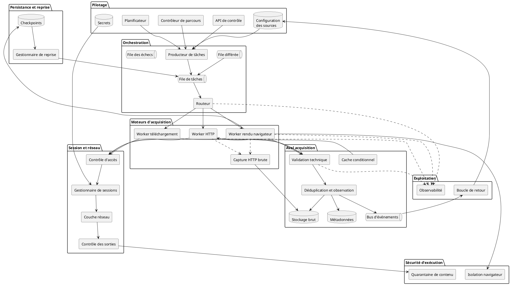
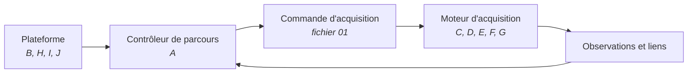

# 00 — Hub : plateforme d'acquisition de contenu web

> **Rôle de ce document** : point d'entrée. Pose l'architecture macro, le diagramme de composants global, la frontière de responsabilité et l'index des fichiers de détail. Logique **macro → micro**.
> **Scope** : pages web et leur contenu uniquement. Trois moteurs — HTTP statique, rendu navigateur, téléchargement de fichier. **Hors scope** : API REST/GraphQL et flux RSS/Atom/Sitemap (chantiers distincts).
> **Capacité transverse** : capture et conservation des échanges HTTP bruts (requête + réponse complètes) pour analyse différée.

---

## 1. Périmètre et principes

### 1.1 Ce que fait la plateforme

Récupérer le contenu de pages web hétérogènes — statiques ou rendues par JavaScript — et les fichiers qu'elles référencent, de façon générique et indépendante du mécanisme concret de navigation ou de protection rencontré. Produire un contenu brut et des métadonnées techniques exploitables par une couche d'extraction ultérieure.

### 1.2 Ce qu'elle ne fait pas

Pas d'extraction métier, pas de normalisation, pas d'interprétation du sens, pas de modèle de données métier. La frontière est posée en § 4.

### 1.3 Principe directeur

Face aux protections d'accès : **détecter, classifier, respecter et s'adapter dans le cadre autorisé** — jamais déjouer. Toute adaptation du contexte d'acquisition est gouvernée (fichier 02, partie session/réseau).

> **Encart conformité — avant production.** Ce blueprint cible un POC. La qualification légale par source (nature des données, `robots.txt`, conditions d'utilisation, base légale RGPD si données personnelles, autorisation contractuelle) doit être traitée **avant tout passage en production** et n'est pas couverte ici.

---

## 2. Carte macro des modules

Hub des groupes de modules. Chaque module porte une description courte. Le détail de chaque groupe est dans son fichier dédié (§ 5).

```mermaid
flowchart TB

subgraph A["A. Pilotage et parcours"]
    A1["Déclenchement<br><i>Planifie et déclenche les collectes</i>"]
    A2["Contrôleur de parcours<br><i>Frontière, priorités, profondeur, couverture</i>"]
    A3["Contrôle préalable<br><i>Règles d'accès, quotas, fréquence, concurrence</i>"]
    A4["Politique de source<br><i>Stratégie, budgets, scénario autorisé</i>"]
end

subgraph B["B. Orchestration distribuée"]
    B1["File de tâches<br><i>Priorité, réservation, backpressure</i>"]
    B2["Cycle de vie<br><i>Machine d'état canonique</i>"]
    B3["Routeur de workers<br><i>Sélection du moteur par tâche</i>"]
    B4["Garanties de traitement<br><i>Idempotence, accusé, réconciliation</i>"]
    B5["Mise à l'échelle<br><i>Capacité, arrêt propre</i>"]
end

subgraph C["C. Session et réseau"]
    C1["Gestion de session<br><i>Authentification, cookies, jetons, état</i>"]
    C2["Couche réseau<br><i>DNS, TLS, pools, délais, redirections</i>"]
    C3["Contrôle des sorties<br><i>Domaines et adresses autorisés, anti-SSRF</i>"]
    C4["Adaptation contrôlée<br><i>Compatibilité gouvernée, jamais dissimulation</i>"]
end

subgraph D["D. Moteurs d'acquisition"]
    D1["Sélection du mode<br><i>Statique puis navigateur</i>"]
    D2["Acquisition HTTP<br><i>Requête, redirections contrôlées</i>"]
    D3["Capture HTTP brute<br><i>Requête et réponse complètes archivées</i>"]
    D4["Rendu navigateur<br><i>Scripts, document vivant, mutations</i>"]
    D5["Téléchargement de fichier<br><i>Ressource liée, contrôle taille et type</i>"]
end

subgraph E["E. Navigation"]
    E1["État prêt<br><i>Combinaison de conditions</i>"]
    E2["Diagnostic du timeout<br><i>Qualifie un délai dépassé</i>"]
    E3["Modes de navigation<br><i>Guidé, sémantique, découverte, scénario</i>"]
    E4["Navigation SPA<br><i>Route, mutations, asynchrone, état</i>"]
    E5["Structures complexes<br><i>Shadow DOM, cadres, infini, virtualisé</i>"]
    E6["Découverte par score<br><i>Confiance par action, frontière priorisée</i>"]
    E7["Formulaires<br><i>Champs autorisés, jetons, soumission</i>"]
end

subgraph F["F. Protections et réaction"]
    F1["Détection<br><i>CAPTCHA, défi, throttling, WAF, environnement</i>"]
    F2["Qualification<br><i>Soft block, hard block, confiance</i>"]
    F3["Politique de réaction<br><i>Respecter, ralentir, replanifier, arrêter</i>"]
end

subgraph G["G. Validation et artefacts"]
    G1["Validation technique<br><i>Statut, type, taille, encodage, empreinte</i>"]
    G2["Cache et conditionnel<br><i>Version, requête conditionnelle, fraîcheur</i>"]
    G3["Déduplication et observation<br><i>Réutilise l'artefact, enregistre l'exécution</i>"]
    G4["Sorties<br><i>Brut, rendu, instantané, fichier, échange HTTP</i>"]
end

subgraph H["H. Persistance et reprise"]
    H1["Checkpoints<br><i>Étape, route, frontière, budget restant</i>"]
    H2["Reprise<br><i>Restaure l'état autorisé ou recommence</i>"]
    H3["Sécurité des secrets<br><i>Aucun secret en clair dans les checkpoints</i>"]
end

subgraph I["I. Sécurité d'exécution"]
    I1["Isolation du navigateur<br><i>Profils éphémères, exécution cloisonnée</i>"]
    I2["Quarantaine de contenu<br><i>Analyse, limites zip et réponse infinie</i>"]
    I3["Cloisonnement des secrets<br><i>Masquage des journaux, anti-exfiltration</i>"]
end

subgraph J["J. Exploitation"]
    J1["Boucle de retour<br><i>Analyse opérationnelle, ajustement gouverné</i>"]
    J2["Observabilité<br><i>Corrélation, métriques par stratégie, SLO</i>"]
    J3["Tests et replay<br><i>Scénario, résilience, non-régression, rejeu</i>"]
end

A --> B
B --> C
B --> D
C --> D
D --> E
D --> F
E --> F
F --> G
D --> G
G --> H
D --> I
G --> J
H --> J

classDef existant fill:#1f3a5f,stroke:#85B7EB,color:#fff;
classDef ajout fill:#5f1f1f,stroke:#F09595,color:#fff;
classDef transverse fill:#1f5f3a,stroke:#9FE1CB,color:#fff;

class A1,A3,A4,C1,D1,D2,D4,D5,E1,E2,E3,E4,E5,E6,E7,F1,F2,F3,G1,G4,C4 existant;
class A2,B1,B2,B3,B4,B5,C2,C3,D3,G2,G3,H1,H2,H3,I1,I2,I3 ajout;
class J1,J2,J3 transverse;
```

| Couleur | Signification |
| --- | --- |
| Bleu | Module spécifié dans le socle fonctionnel |
| Rouge | Module ajouté (dimension plateforme, sécurité, reprise) |
| Vert | Module transverse (exploitation) |

---

## 3. Diagramme de composants global

Vue d'assemblage des composants déployables et de leurs dépendances. Notation composants (PlantUML).

---

## 4. Frontière de responsabilité

### 4.1 Acquisition contre extraction

La plateforme produit du contenu brut et des métadonnées. Elle ne produit pas le modèle métier.

Validation technique minimale admise dans l'acquisition : statut, type de contenu, taille, encodage, intégrité, présence du document, empreinte. Rien de plus.

### 4.2 Parcours contre acquisition contre plateforme

Trois responsabilités à ne pas fusionner.

| Responsabilité | Périmètre | Ne fait pas |
| --- | --- | --- |
| Contrôleur de parcours | Frontière, priorités, profondeur, domaines, budgets globaux, couverture | Requête, rendu, session |
| Moteur d'acquisition | Requête, session, navigation, rendu, téléchargement, validation technique, artefacts | Orchestration, couverture |
| Plateforme | Distribution, cycle de vie, persistance, sécurité d'exécution, exploitation | Acquisition unitaire |

---

## 5. Index des fichiers

| Fichier | Contenu | Groupes | Diagrammes |
| --- | --- | --- | --- |
| `00-hub.md` | Ce document | Tous (macro) | Composants global, flux macro |
| `01-contrats-modele-donnees.md` | Commande, résultat, artefact, checkpoint, échange HTTP, identifiants | Transverse | Classes, entités |
| `02-pilotage-distribution.md` | Pilotage, parcours, file, cycle de vie, idempotence, résilience | A, B | Composant, activité, état, séquence |
| `03-session-reseau.md` | Session, accès, réseau, anti-SSRF, adaptation contrôlée | C | Composant, activité, séquence |
| `04-moteur-navigation.md` | Moteurs, sélection de mode, état prêt, SPA, structures, découverte, formulaires, capture HTTP | D, E | Composant, activité, séquence, état |
| `05-protections-reaction.md` | Détection, qualification soft/hard, politique de réaction | F | Composant, activité, séquence |
| `06-validation-artefacts.md` | Validation technique, cache conditionnel, déduplication, observation, sorties | G | Composant, activité |
| `07-persistance-securite-exploitation.md` | Checkpoints, reprise, isolation, quarantaine, observabilité, boucle de retour, tests | H, I, J | Composant, activité, état, séquence |

---

## 6. Décisions d'architecture verrouillées

> **Encart — à ne pas réintroduire.** Deux motifs ont été écartés en arbitrage et ne doivent pas être réimportés depuis des variantes techniques de ce blueprint :
>
> 1. **Rotation automatique d'identité ou de réseau** (rotation de proxies, usurpation d'empreinte, profils d'identité tournants pour échapper à une détection). Remplacé par l'adaptation contrôlée et gouvernée (fichier 03). La compatibilité technique légitime est admise ; la dissimulation ne l'est pas.
> 2. **Déduplication menant à « contenu ignoré » pur.** Même si l'empreinte existe déjà, une **observation d'acquisition** doit être enregistrée (preuve d'interrogation, date, statut, latence, fraîcheur). Voir fichier 06, déduplication et observation.

---

## 7. Encart MVP

Architecture cible documentée dans les fichiers 01 à 07. Pour un premier déploiement, un découpage pragmatique suffit, sans éclater en douze services.

| Composant MVP | Rôle |
| --- | --- |
| `acquisition-api` | Pilotage et soumission de commandes |
| `acquisition-dispatcher` | Producteur de tâches et routage |
| `acquisition-http-worker` | Moteur HTTP statique + capture brute |
| `acquisition-browser-worker` | Moteur rendu navigateur (isolé) |
| `acquisition-storage` | Écriture brut, métadonnées, événements |

Services d'infrastructure partagés : file de messages, base relationnelle (configuration et métadonnées), coffre à secrets, stockage objet, cache. L'observabilité (métriques, traces, journaux) est branchée transversalement dès le MVP.

---

## 8. Ordre de lecture conseillé

1. `00-hub.md` (ce document) — vue macro
2. `01-contrats-modele-donnees.md` — le vocabulaire partagé par tous les autres fichiers
3. `02` à `07` — dans l'ordre, chacun ouvrant sur son diagramme de composants
