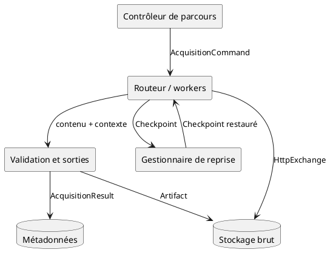
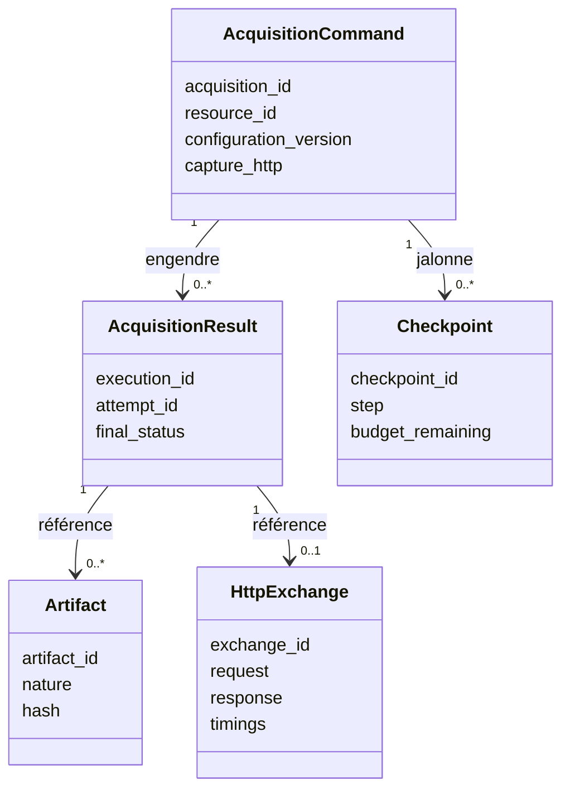

# 01 — Contrats et modèle de données

> **Rôle** : définir le vocabulaire partagé par tous les fichiers. Identifiants d'idempotence, contrats d'entrée et de sortie, modèle de l'échange HTTP brut conservé pour analyse différée.
> **Prérequis** : `00-hub.md`.

---

## 1. Diagramme de composants — flux des contrats

Où chaque contrat naît et est consommé.



---

## 2. Identifiants et idempotence

Distinction indispensable pour garantir qu'une nouvelle tentative ne crée pas une nouvelle acquisition logique.

| Identifiant | Fonction | Stabilité |
| --- | --- | --- |
| `acquisition_id` | Demande logique globale | Stable sur toute la vie de la demande |
| `source_id` | Source configurée | Stable |
| `resource_id` | Ressource canonique ciblée (URL canonicalisée) | Stable |
| `execution_id` | Exécution effective d'une commande | Nouveau par exécution |
| `attempt_id` | Tentative individuelle au sein d'une exécution | Nouveau par tentative |
| `artifact_id` | Contenu physique produit | Immuable, dérivé de l'empreinte |
| `exchange_id` | Échange HTTP brut capturé | Immuable |
| `configuration_version` | Version de configuration appliquée | Référence figée à l'exécution |
| `correlation_id` | Corrélation transverse (observabilité) | Propagé de bout en bout |

### Modèle de garanties retenu

```text
Distribution : au moins une fois
+ Workers idempotents (clé = acquisition_id + configuration_version)
+ Publication réconciliable (résultat rejouable sans doublon métier)
```

Règle : `acquisition_id` est fourni ou dérivé de `resource_id + configuration_version`. Les retries réutilisent `acquisition_id` et `execution_id`, incrémentent `attempt_id`.

---

## 3. Contrat — commande d'acquisition

Entrée du moteur, émise par le contrôleur de parcours ou l'API.

```text
AcquisitionCommand
├── acquisition_id            identifiant logique global
├── source_id                 source configurée
├── resource_id               ressource canonique (URL canonicalisée)
├── url                       adresse cible
├── strategy_hint             mode préféré : auto | http | browser | file
├── policy                    politique d'accès applicable
├── scenario                  scénario de navigation optionnel
├── priority                  priorité d'ordonnancement
├── budgets                   budgets temps, pages, coût d'exécution
├── timeout                   délai maximal
├── max_attempts              plafond de tentatives
├── configuration_version     version de configuration figée
├── capture_http              booléen : archiver l'échange brut
└── correlation_id            contexte de corrélation
```

### Représentation JSON

```json
{
  "acquisition_id": "acq-20260627-000123",
  "source_id": "source-exemple",
  "resource_id": "res-exemple-page-123",
  "url": "https://exemple.org/page/123",
  "strategy_hint": "auto",
  "policy": "politique-exemple-fr",
  "scenario": null,
  "priority": 5,
  "budgets": { "max_pages": 1, "time_ms": 30000, "render_cost": "low" },
  "timeout": 30000,
  "max_attempts": 4,
  "configuration_version": "cfg-2026-06-01",
  "capture_http": true,
  "correlation_id": "corr-abc123"
}
```

---

## 4. Contrat — résultat d'acquisition

Sortie du moteur vers les métadonnées et le bus d'événements.

```text
AcquisitionResult
├── acquisition_id            rappel de la demande logique
├── execution_id              exécution effective
├── attempt_id                tentative ayant abouti
├── final_status             SUCCESS | UNCHANGED | RETRYABLE | PERMANENT | BLOCKED
├── strategy_used            mode réellement employé
├── artifacts                 liste d'artifact_id produits
├── http_exchange_ref         référence de l'échange brut (si capturé)
├── response_metadata         statut, type, taille, encodage, empreinte
├── step_timeline             chronologie des étapes de navigation
├── errors                    erreurs et classifications
├── budget_usage              consommation des budgets
└── trace_refs                références de traçabilité
```

### Représentation JSON

```json
{
  "acquisition_id": "acq-20260627-000123",
  "execution_id": "exec-000457",
  "attempt_id": "try-1",
  "final_status": "SUCCESS",
  "strategy_used": "http",
  "artifacts": ["art-sha256-9f2a"],
  "http_exchange_ref": "exch-000457-1",
  "response_metadata": {
    "status_code": 200,
    "content_type": "text/html",
    "content_length": 45872,
    "encoding": "utf-8",
    "content_hash": "sha256:9f2a..."
  },
  "step_timeline": [],
  "errors": [],
  "budget_usage": { "time_ms": 846, "attempts": 1 },
  "trace_refs": { "correlation_id": "corr-abc123" }
}
```

---

## 5. Contrat — artefact

Contenu physique produit, immuable, référencé par les métadonnées.

```text
Artifact
├── artifact_id               identifiant immuable (dérivé de l'empreinte)
├── nature                   raw_response | rendered_document | page_snapshot | downloaded_file
├── content_type             type de contenu
├── size                     taille en octets
├── hash                     empreinte
├── location                 emplacement de stockage objet
├── created_at               date de création
├── provenance               acquisition_id, execution_id, url finale
├── retention_policy         politique de conservation
└── sensitivity              classification de sensibilité
```

### Natures d'artefact — définitions disjointes

| Nature | Définition précise | Produit par |
| --- | --- | --- |
| `raw_response` | Corps de réponse HTTP tel que reçu, avant toute exécution | Worker HTTP, worker fichier |
| `rendered_document` | Document après exécution des scripts de la page | Worker rendu navigateur |
| `page_snapshot` | Capture de l'état observable de la page (sérialisation du document vivant à un instant) | Worker rendu navigateur |
| `downloaded_file` | Fichier distinct référencé par la page et téléchargé | Worker téléchargement |

Ces quatre natures ne se recouvrent pas : une même acquisition navigateur peut produire un `rendered_document` et un `page_snapshot`, qui sont des artefacts distincts.

---

## 6. Contrat — échange HTTP brut

Capacité transverse demandée : conserver l'intégralité de chaque échange HTTP pour analyse différée. Distinct de l'artefact de contenu.

```text
HttpExchange
├── exchange_id               identifiant immuable
├── acquisition_id            rattachement à la demande logique
├── execution_id              exécution
├── attempt_id                tentative
├── request
│   ├── method               méthode
│   ├── url                  adresse demandée
│   ├── headers              en-têtes envoyés (secrets masqués)
│   ├── body                 corps de requête éventuel
│   └── sent_at              horodatage d'envoi
├── response
│   ├── status_code         statut
│   ├── headers             en-têtes reçus
│   ├── body_ref            référence du corps brut en stockage objet
│   ├── received_at         horodatage de réception
│   └── final_url           adresse finale après redirections
├── redirect_chain           liste ordonnée des redirections suivies
├── timings
│   ├── dns_ms              résolution
│   ├── connect_ms          établissement de connexion
│   ├── tls_ms              négociation TLS
│   ├── ttfb_ms             temps jusqu'au premier octet
│   └── total_ms            durée totale
└── network_context          version de protocole, adresse résolue, réutilisation de connexion
```

### Représentation JSON

```json
{
  "exchange_id": "exch-000457-1",
  "acquisition_id": "acq-20260627-000123",
  "execution_id": "exec-000457",
  "attempt_id": "try-1",
  "request": {
    "method": "GET",
    "url": "https://exemple.org/page/123",
    "headers": { "user-agent": "...", "accept": "text/html" },
    "body": null,
    "sent_at": "2026-06-27T20:00:01.100Z"
  },
  "response": {
    "status_code": 200,
    "headers": { "content-type": "text/html", "etag": "\"abc\"" },
    "body_ref": "raw/exemple.org/2026/06/27/exch-000457-1.bin",
    "received_at": "2026-06-27T20:00:01.946Z",
    "final_url": "https://exemple.org/page/123"
  },
  "redirect_chain": [],
  "timings": { "dns_ms": 12, "connect_ms": 30, "tls_ms": 40, "ttfb_ms": 700, "total_ms": 846 },
  "network_context": { "protocol": "h2", "resolved_ip": "203.0.113.10", "connection_reused": false }
}
```

> Pour le worker rendu navigateur, chaque requête réseau secondaire déclenchée par la page peut produire son propre `HttpExchange`, rattaché à la même `execution_id`. La politique de capture (toutes les requêtes, ou seulement le document principal) est un paramètre de la commande.

---

## 7. Contrat — checkpoint

État sérialisable permettant la reprise d'une navigation longue. Détail du mécanisme dans le fichier 07.

```text
Checkpoint
├── checkpoint_id             identifiant
├── acquisition_id            rattachement
├── execution_id              exécution en cours
├── step                     étape du scénario atteinte
├── serializable_state       état restaurable (route, position, pagination)
├── visited_resources        ressources déjà visitées
├── frontier_state           état de la frontière de crawling
├── budget_remaining         budget restant
├── expires_at               date d'expiration
└── scenario_version         version du scénario
```

> **Sécurité** : aucun secret ni jeton de session sensible n'est stocké en clair dans un checkpoint. Les secrets sont référencés et re-résolus depuis le coffre à la reprise (fichier 03 et fichier 07).

---

## 8. Diagramme de classes — relations entre contrats



---

## 9. États finaux normalisés

Valeurs de `final_status`, partagées avec la machine d'état du fichier 02.

| Statut | Signification | Suite |
| --- | --- | --- |
| `SUCCESS` | Contenu acquis et stocké | Publication d'événement |
| `UNCHANGED` | Contenu inchangé (cache conditionnel) | Observation enregistrée, pas de nouvel artefact |
| `RETRYABLE` | Échec temporaire | Replanification différée bornée |
| `PERMANENT` | Échec définitif | File des échecs |
| `BLOCKED` | Protection ou refus d'accès | Politique de réaction (fichier 05) |
