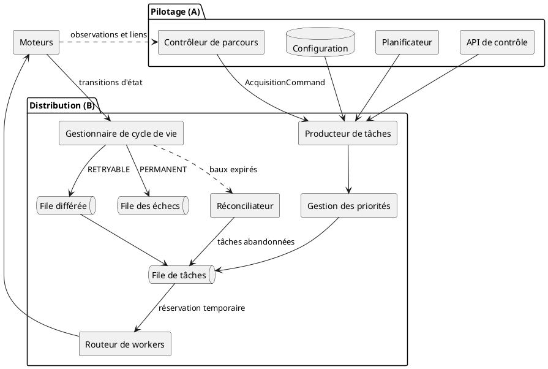
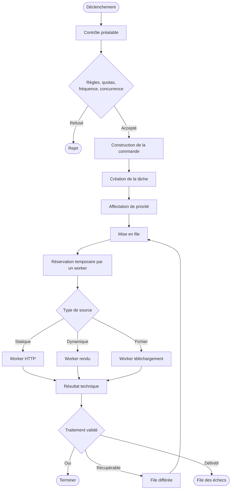
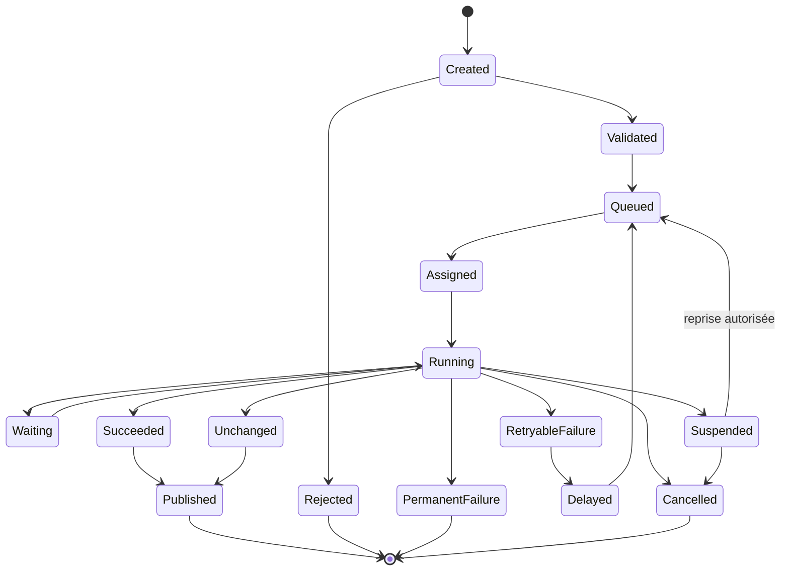
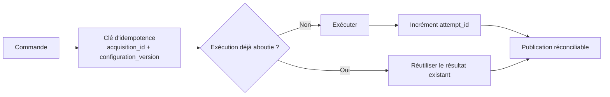
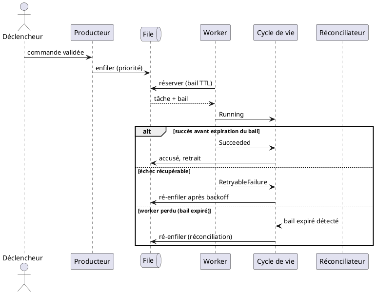
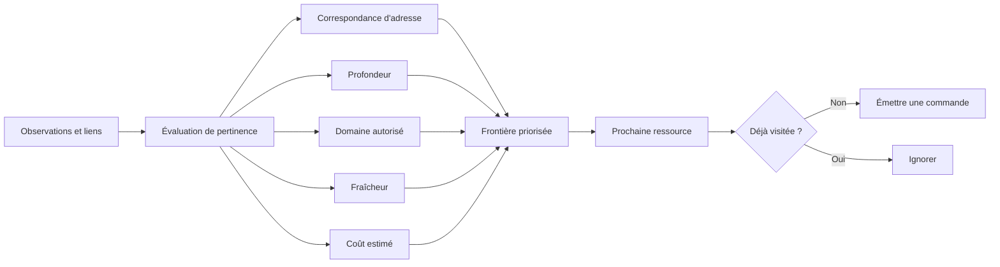
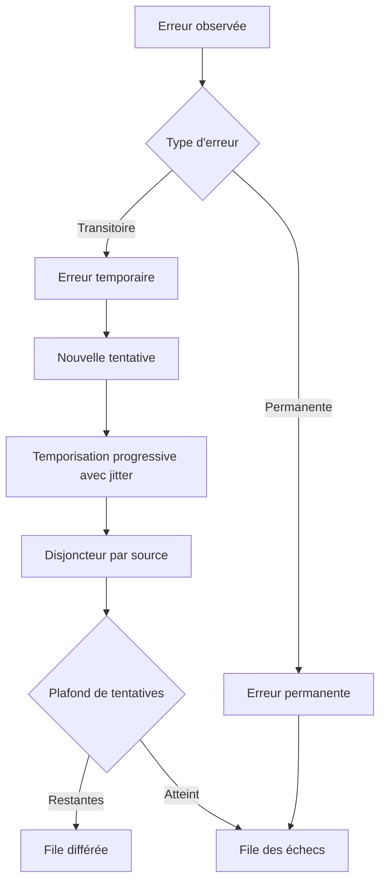

# 02 — Pilotage et distribution

> **Groupes** : A (pilotage et parcours), B (orchestration distribuée).
> **Prérequis** : `00-hub.md`, `01-contrats-modele-donnees.md`.
> **Contenu** : déclenchement, contrôleur de parcours, file de tâches, routage, cycle de vie, garanties de traitement, résilience.

---

## 1. Diagramme de composants

Le contrôleur de parcours et les moteurs sont séparés : le premier décide quoi visiter, les seconds exécutent. La boucle observations → parcours alimente la découverte sans fusionner les responsabilités.

---

## 2. Diagramme d'activité — du déclenchement à la terminaison

Fonctions de distribution couvertes : planification, file, priorité, réservation temporaire (bail), accusé de traitement, contrôle de concurrence, backpressure, répartition par capacité, mise à l'échelle, arrêt propre, file des échecs, réconciliation des tâches abandonnées.

---

## 3. Machine d'état du cycle de vie

État canonique d'une acquisition, aligné sur les `final_status` du fichier 01.

### Attributs de transition

Chaque transition précise : acteur responsable, délai maximal, événement produit, possibilité de reprise, compteur de tentatives, motif de transition, conservation des artefacts intermédiaires.

| Transition | Acteur | Borne | Événement |
| --- | --- | --- | --- |
| `Created → Validated` | Contrôle préalable | — | `acquisition.validated` |
| `Assigned → Running` | Worker (bail acquis) | TTL de bail | `acquisition.started` |
| `Running → Waiting` | Worker (attente d'état prêt) | timeout | — |
| `Running → RetryableFailure` | Worker | — | `acquisition.retry` |
| `RetryableFailure → Delayed` | Cycle de vie | backoff | — |
| `Delayed → Queued` | Cycle de vie | délai écoulé | `acquisition.requeued` |
| `Running → Suspended` | Worker (checkpoint) | TTL checkpoint | `acquisition.suspended` |
| `Succeeded → Published` | Sorties | — | `document.acquired` |

---

## 4. Idempotence et garanties

Principe : une nouvelle tentative réutilise `acquisition_id` et `execution_id`, n'incrémente que `attempt_id`, et ne crée jamais une nouvelle acquisition logique. La publication est réconciliable, de sorte qu'un événement émis deux fois ne produit pas de doublon en aval.

---

## 5. Diagramme de séquence — réservation, exécution, accusé

Dialogue entre file, worker et cycle de vie, avec gestion du bail.

Le bail (réservation temporaire) protège contre la perte d'un worker : si l'accusé n'arrive pas avant l'expiration, le réconciliateur ré-enfile la tâche. Couplé à l'idempotence (§ 4), cela donne une sémantique « au moins une fois » sans double effet.

---

## 6. Contrôleur de parcours

Découplé des moteurs. Gère la frontière priorisée et la boucle de découverte.

Responsabilités de la frontière : priorité, profondeur maximale, domaine autorisé, canonicalisation des adresses, détection des cycles, budget de pages, budget temporel, coût d'exécution estimé, fraîcheur attendue, reprise après erreur.

---

## 7. Résilience

> **Garde-fous obligatoires** : compteur de tentatives plafonné (`max_attempts`), disjoncteur par source pour suspendre une source défaillante, budget temporel par acquisition. Toute boucle de replanification est bornée — pas de réinjection infinie.
