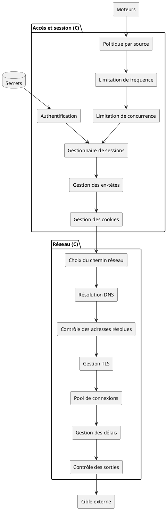
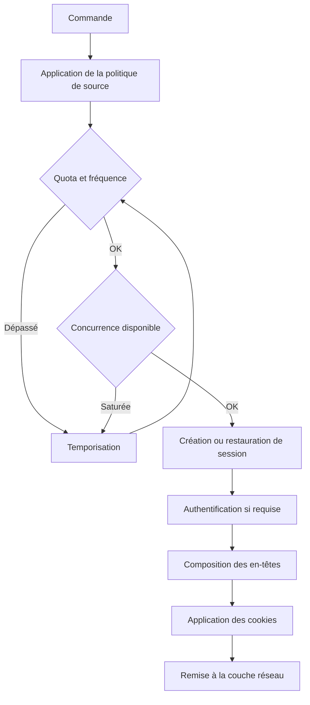
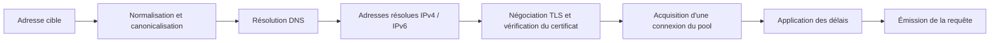
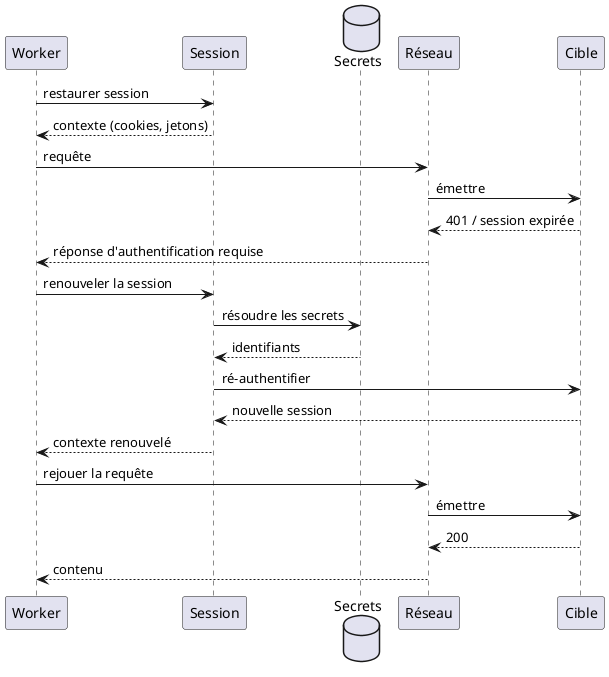
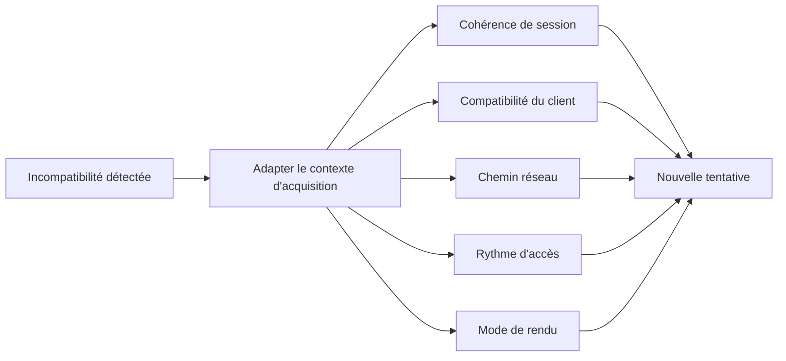

# 03 — Session et réseau

> **Groupe** : C (session et réseau).
> **Prérequis** : `00-hub.md`, `01-contrats-modele-donnees.md`.
> **Contenu** : gestion de session, contrôle d'accès, couche réseau, contrôle des sorties et anti-SSRF (différé pré-production), adaptation du contexte.
> **Stack** : client HTTP **httpx** (sync+async, HTTP/2, pool, timeouts, en-têtes conditionnels ETag/304, streaming) ; transport furtif **curl_cffi** (TLS/JA3, escalade N2) ; cache conditionnel **Hishel** ; sniffing MIME **filetype** ; détection charset **charset-normalizer**. Détail : `08-stack-techno.md`.
>
> 🔒 **POC sans contrainte.** Le contrôle des sorties / anti-SSRF / DNS pinné (§ 4) est documenté comme **architecture cible** mais relève de la **phase pré-production** : **aucun blocage actif au POC**. Voir l'encart du hub (`00-hub.md`).

---

## 1. Diagramme de composants

La couche réseau est commune aux trois moteurs (HTTP, rendu, fichier). Côté client HTTP, elle s'appuie sur **httpx** (pool de connexions, HTTP/2, délais de connexion/lecture, en-têtes conditionnels) ; le transport furtif **curl_cffi** (empreinte TLS/JA3) est mobilisé en escalade. Le contrôle des adresses résolues s'intercalerait entre la résolution DNS et l'établissement de connexion (point anti-SSRF) — **prévu mais inactif au POC**, voir § 4.

---

## 2. Diagramme d'activité — chaîne d'accès

La session porte cookies, jetons temporaires, jetons de formulaire et état de navigation. Les secrets d'authentification sont résolus depuis le coffre, jamais codés en dur ni journalisés en clair.

---

## 3. Couche réseau détaillée

Fonctions couvertes : résolution DNS, contrôle des adresses résolues, gestion TLS et certificats, protocoles et versions, pools de connexions, keep-alive, délais de connexion/lecture/traitement, redirections, compression, limites de réponse, chemins réseau autorisés, politique de sortie, corrélation des erreurs réseau, gestion IPv4/IPv6.

Chaque échange alimente le contrat `HttpExchange` (fichier 01) : timings DNS/connect/TLS/TTFB, version de protocole, adresse résolue, réutilisation de connexion.

---

## 4. Contrôle des sorties et anti-SSRF *(architecture cible — phase pré-production)*

> 🔒 **Différé pré-production — inactif au POC.** Au POC le module **collecte librement**, sans allowlist de domaines, sans blocage d'adresses ni politique d'egress. La cible décrite ci-dessous (contrôle des adresses résolues précédant toute connexion, rejoué après chaque redirection, DNS pinné) est **à coder en phase pré-production** — elle dépend des pays visés. Aucun outil dédié n'est encore « Sélectionné » (cf. `08-stack-techno.md`, `etapes.md`). Le diagramme et le tableau ci-après documentent ce mécanisme **futur**, pas un contrôle appliqué au POC.

| Risque réseau | Contrôle |
| --- | --- |
| SSRF | Liste de domaines et réseaux autorisés |
| Accès aux réseaux internes | Blocage des adresses privées, locales et métadonnées cloud |
| Redirection malveillante | Revalidation complète après chaque redirection |
| DNS rebinding | Validation de l'adresse résolue immédiatement avant connexion |
| Exfiltration réseau | Contrôle des destinations sortantes (politique d'egress) |

La quarantaine de contenu (bombe zip, réponse infinie) et l'isolation du navigateur sont traitées dans le fichier 07 (sécurité d'exécution).

---

## 5. Diagramme de séquence — session expirée en cours d'acquisition

Le renouvellement de session rejoue l'authentification de la source pour rétablir un accès expiré.

---

## 6. Adaptation du contexte

Leviers d'adaptation du contexte d'acquisition disponibles lorsqu'une incompatibilité est détectée.

| Levier d'adaptation |
| --- |
| Maintien de la cohérence de session |
| Compatibilité du client avec les exigences du site |
| Rotation d'identité ou de proxies |
| Usurpation d'empreinte |
| Ajustement du rythme d'accès |
| Choix du mode de rendu adapté |
