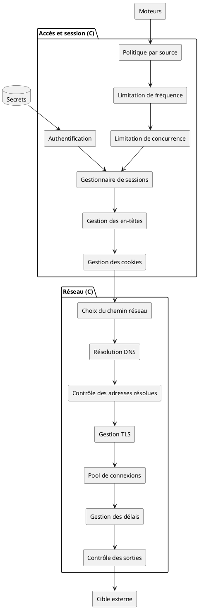
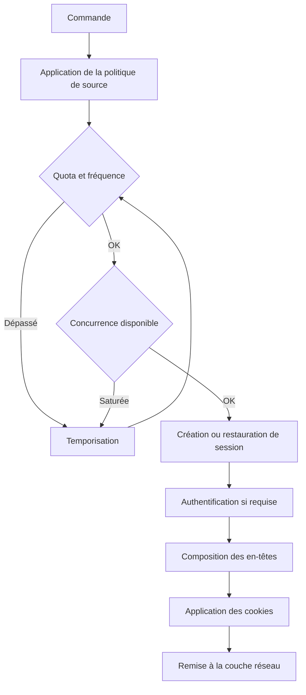
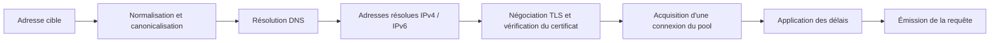
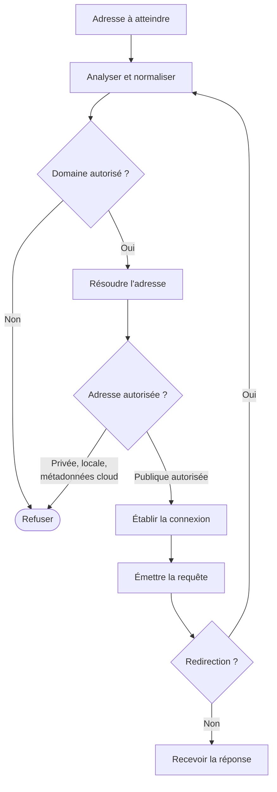
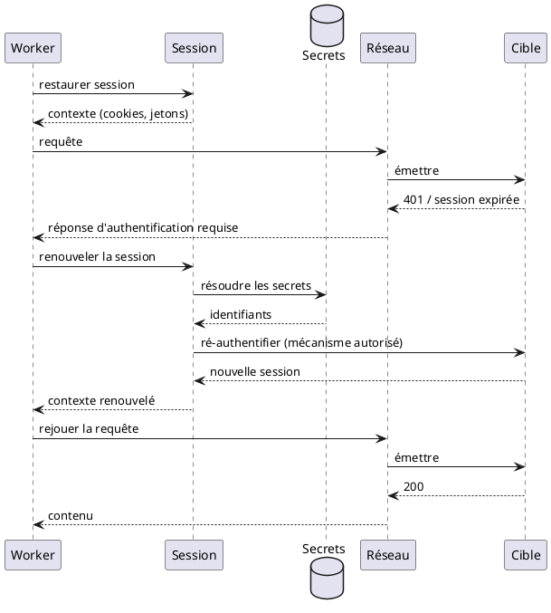
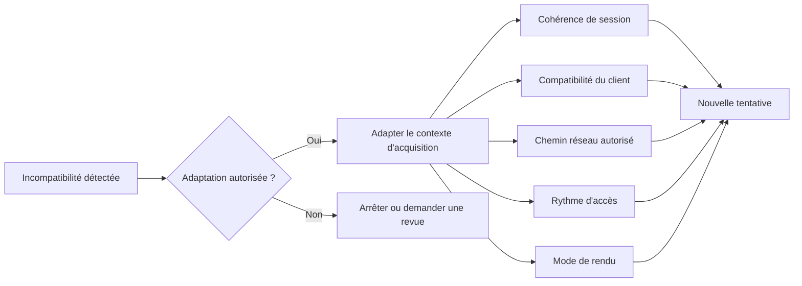

# 03 — Session et réseau

> **Groupe** : C (session et réseau).
> **Prérequis** : `00-hub.md`, `01-contrats-modele-donnees.md`.
> **Contenu** : gestion de session, contrôle d'accès, couche réseau, contrôle des sorties et anti-SSRF, adaptation contrôlée du contexte.

---

## 1. Diagramme de composants

La couche réseau est commune aux trois moteurs (HTTP, rendu, fichier). Le contrôle des adresses résolues s'intercale entre la résolution DNS et l'établissement de connexion : c'est le point anti-SSRF.

---

## 2. Diagramme d'activité — chaîne d'accès

La session porte cookies, jetons temporaires, jetons de formulaire et état de navigation. Les secrets d'authentification sont résolus depuis le coffre, jamais codés en dur ni journalisés en clair.

---

## 3. Couche réseau détaillée

Fonctions couvertes : résolution DNS, contrôle des adresses résolues, gestion TLS et certificats, protocoles et versions, pools de connexions, keep-alive, délais de connexion/lecture/traitement, redirections, compression, limites de réponse, chemins réseau autorisés, politique de sortie, corrélation des erreurs réseau, gestion IPv4/IPv6.

Chaque échange alimente le contrat `HttpExchange` (fichier 01) : timings DNS/connect/TLS/TTFB, version de protocole, adresse résolue, réutilisation de connexion.

---

## 4. Contrôle des sorties et anti-SSRF

Point de sécurité critique. Le contrôle des adresses résolues précède toute connexion et est rejoué après chaque redirection.

| Risque réseau | Contrôle |
| --- | --- |
| SSRF | Liste de domaines et réseaux autorisés |
| Accès aux réseaux internes | Blocage des adresses privées, locales et métadonnées cloud |
| Redirection malveillante | Revalidation complète après chaque redirection |
| DNS rebinding | Validation de l'adresse résolue immédiatement avant connexion |
| Exfiltration réseau | Contrôle des destinations sortantes (politique d'egress) |

La quarantaine de contenu (bombe zip, réponse infinie) et l'isolation du navigateur sont traitées dans le fichier 07 (sécurité d'exécution).

---

## 5. Diagramme de séquence — session expirée en cours d'acquisition

Le renouvellement de session est un mécanisme autorisé : il rejoue l'authentification normale de la source. Il ne s'agit pas de contourner une protection mais de rétablir un accès légitime expiré.

---

## 6. Adaptation contrôlée du contexte

Remplace toute notion de « stealth ». Distingue la compatibilité technique légitime de la dissimulation. Seule la première est admise, et uniquement si la politique l'autorise.

| Admis (compatibilité) | Exclu — voir encart hub § 6 |
| --- | --- |
| Maintien de la cohérence de session | Rotation automatique d'identité pour éviter un blocage |
| Compatibilité du client avec les exigences normales du site | Usurpation d'empreinte pour déjouer une détection |
| Utilisation d'un chemin réseau autorisé | Rotation de proxies destinée à contourner un bannissement |
| Ajustement du rythme d'accès | — |
| Choix du mode de rendu adapté | — |

> Rappel verrouillé (hub § 6) : la rotation automatique d'identité ou de réseau n'est pas le comportement standard de la plateforme.
