# 04 — Moteur d'acquisition et navigation

> **Groupes** : D (moteurs), E (navigation).
> **Prérequis** : `00-hub.md`, `01-contrats-modele-donnees.md`, `03-session-reseau.md`.
> **Scope** : pages web. Trois moteurs — HTTP statique, rendu navigateur, téléchargement de fichier. Capture HTTP brute transverse.
> **Cœur fonctionnel** du blueprint : tout le détail de navigation est ici, pas masqué dans une boîte.

---

## 1. Diagramme de composants

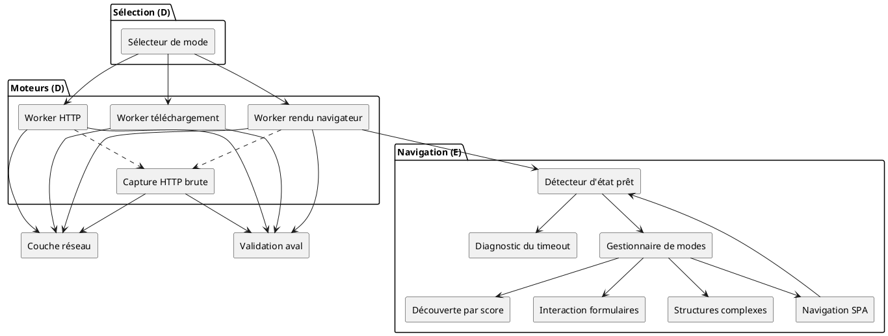

La capture HTTP brute s'intercale sur le trajet réseau des moteurs HTTP et navigateur : chaque requête/réponse est archivée comme `HttpExchange` (fichier 01) avant traitement, pour analyse différée.

---

## 2. Sélection du mode — escalade de coût

Ne jamais lancer le rendu navigateur par défaut : il est nettement plus coûteux en mémoire, CPU et temps.

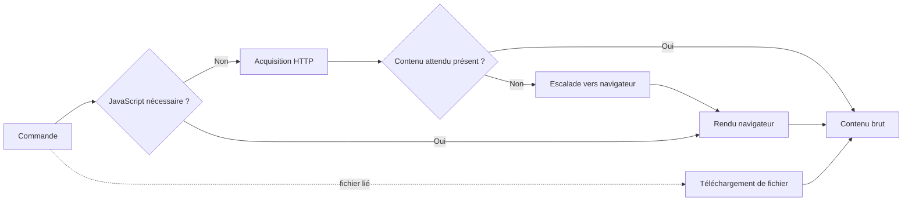

| Mode | Déclencheur | Coût |
| --- | --- | --- |
| Acquisition HTTP | Contenu statique, pas d'exécution requise | Faible |
| Téléchargement de fichier | Ressource fichier référencée | Variable |
| Rendu navigateur | Contenu injecté par script, SPA | Élevé |

---

## 3. Capture HTTP brute pour analyse différée

Capacité transverse. Conserve l'intégralité de l'échange indépendamment du traitement du contenu.

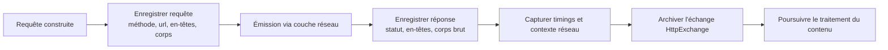

Pour le rendu navigateur, chaque requête réseau secondaire déclenchée par la page peut produire son propre `HttpExchange`, rattaché à la même `execution_id`. La politique de capture (document principal seul, ou toutes les requêtes) est un paramètre de la commande (`capture_http`).

---

## 4. Acquisition HTTP statique

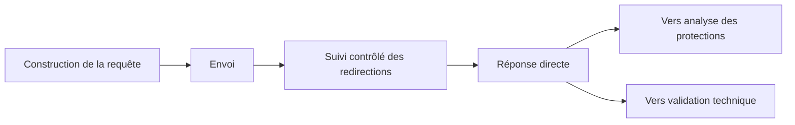

Le suivi des redirections rejoue le contrôle anti-SSRF à chaque saut (fichier 03 § 4).

---

## 5. Rendu navigateur

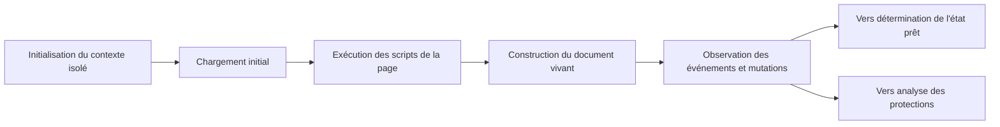

Le contexte navigateur est éphémère et cloisonné (fichier 07, isolation). L'acquisition porte sur le document après exécution, pas seulement sur le HTML initial.

---

## 6. Détermination de l'état prêt

Une SPA n'a pas toujours d'événement unique « chargement terminé ». La disponibilité se détermine par combinaison de conditions, jamais par simple attente temporelle ni par réseau inactif seul.

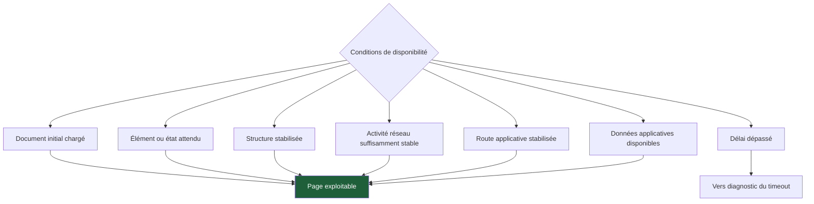

L'état « réseau totalement inactif » n'est pas utilisé seul : une SPA peut conserver des connexions permanentes ou émettre des appels périodiques.

---

## 7. Diagnostic du timeout

Un timeout n'est pas un échec terminal : c'est un symptôme à qualifier.

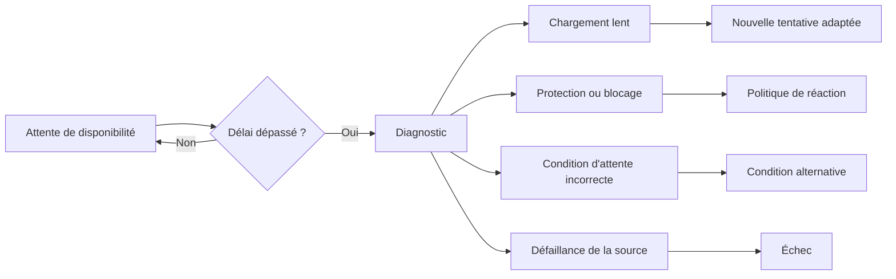

Causes possibles : élément attendu absent, erreur JavaScript, ressource bloquée, route SPA non atteinte, contenu dans un cadre ou un Shadow DOM, flux réseau permanent, throttling, challenge ou page intermédiaire, sélecteur obsolète.

---

## 8. Modes de navigation

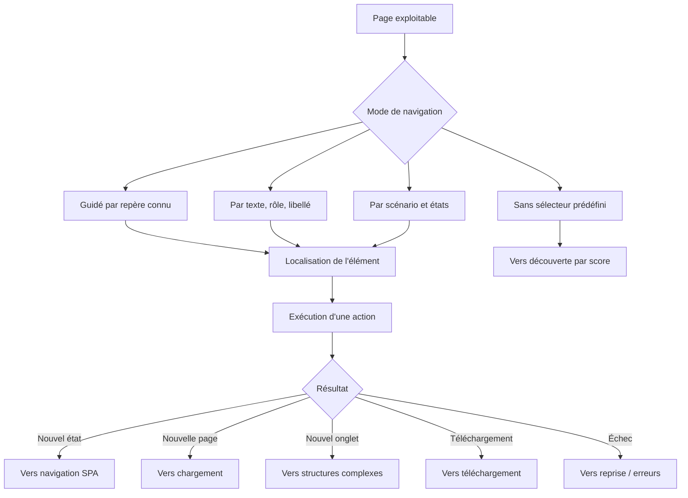

| Mode | Description | Exemple |
| --- | --- | --- |
| Guidé techniquement | Repère technique fourni | Cliquer sur un élément identifié |
| Guidé fonctionnellement | Texte, rôle, libellé, valeur | Cliquer sur « page suivante » |
| Découverte automatique | Analyse des actions disponibles | Parcourir les fiches d'un catalogue |
| Piloté par URL | Génération ou découverte d'adresses | Suivre une pagination numérotée |
| Piloté par état | Actions selon l'état courant | Authentification, recherche, détail |
| Hybride | Combinaison avec repli | Sélecteur principal et solutions de repli |

---

## 9. Navigation SPA

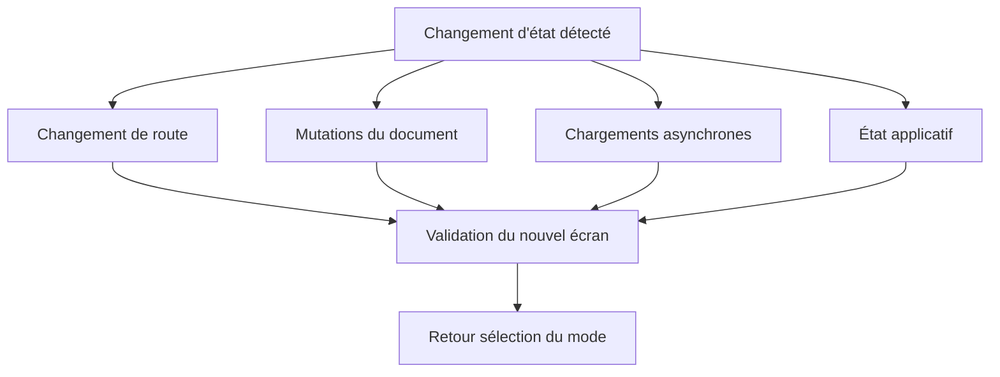

Attente correcte du nouvel écran — combinaison de conditions, comme en § 6 : route attendue atteinte, élément attendu présent, document suffisamment stable, données visibles, requêtes critiques terminées.

---

## 10. Structures de page complexes

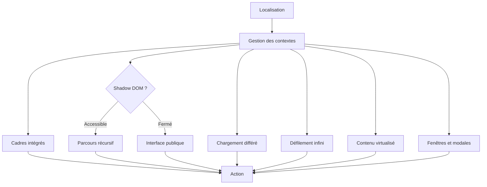

| Structure | Stratégie |
| --- | --- |
| Shadow DOM ouvert | Parcours récursif des arbres accessibles |
| Shadow DOM fermé | Interaction par l'interface publique ou instrumentation autorisée |
| Cadres intégrés | Changement explicite de contexte |
| Chargement différé | Défilement ou interaction déclenchant le chargement |
| Défilement infini | Acquisition incrémentale jusqu'à condition d'arrêt |
| Contenu virtualisé | Capture progressive (les éléments précédents disparaissent) |
| Modales et fenêtres | Détection, changement de contexte, reprise du scénario |

---

## 11. Découverte sans sélecteur, pondérée par confiance

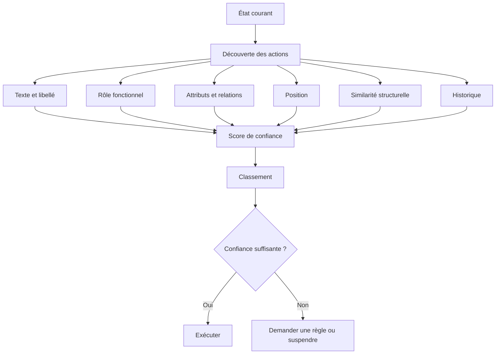

| Critère | Utilité |
| --- | --- |
| Texte visible | Identifier « Suivant », « Détail », « Télécharger » |
| Rôle fonctionnel | Distinguer bouton, lien, champ, onglet |
| Adresse cible | Éviter les liens externes ou non pertinents |
| Position | Repérer navigation principale, pagination, pied de page |
| Similarité structurelle | Regrouper cartes ou lignes d'une liste |
| Historique | Éviter les boucles |
| État visible | Éviter éléments masqués ou désactivés |
| Résultat attendu | Vérifier qu'une action produit l'état recherché |

---

## 12. Interaction avec les formulaires

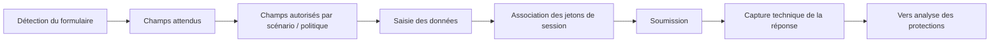

Vigilance honeypot : interagir **uniquement** avec les champs autorisés par le scénario, la politique de source ou une règle fonctionnelle validée — pas seulement les champs visibles, car un champ légitime peut être temporairement masqué et un piège peut paraître visible. La réponse de soumission est **capturée et classifiée techniquement** ; les erreurs fonctionnelles sont transmises à la couche d'extraction, non interprétées ici.

---

## 13. Diagramme d'état d'une session de navigation

Cycle de vie interne d'une session de rendu navigateur, du contexte à sa fermeture.

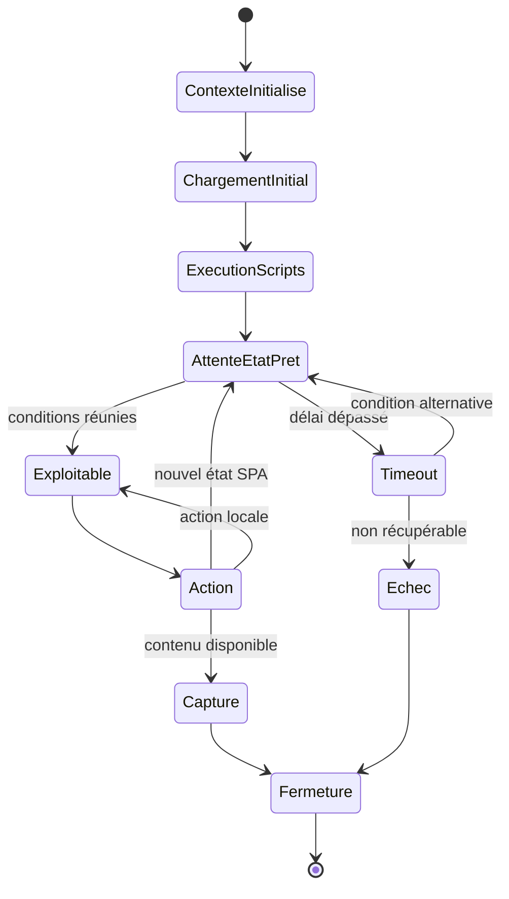

---

## 14. Diagramme de séquence — escalade HTTP vers navigateur

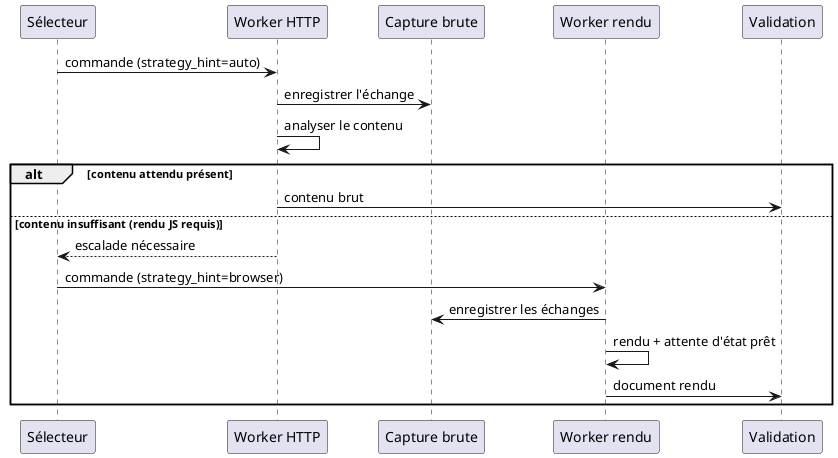

L'échange HTTP initial est archivé même quand le contenu se révèle insuffisant : la capture brute sert l'analyse différée indépendamment du résultat fonctionnel.
