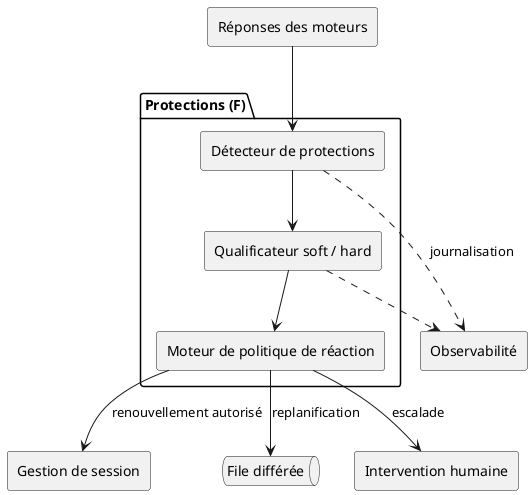
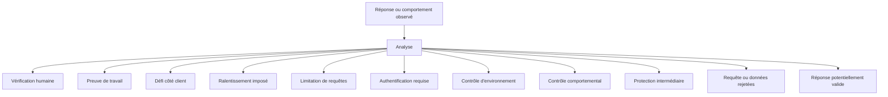
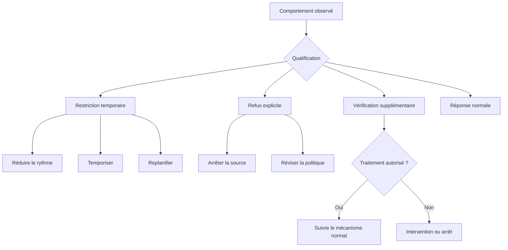
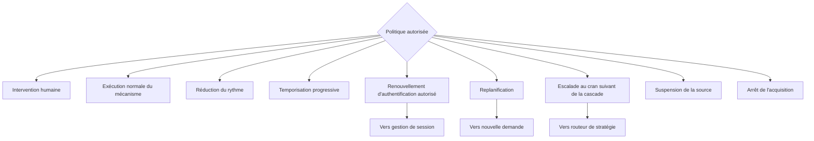
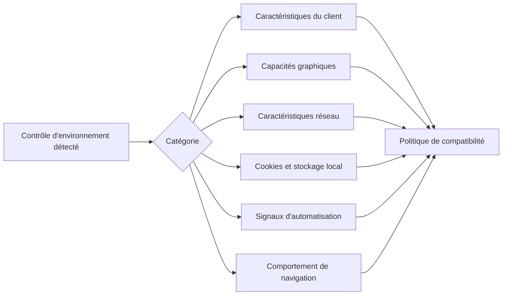
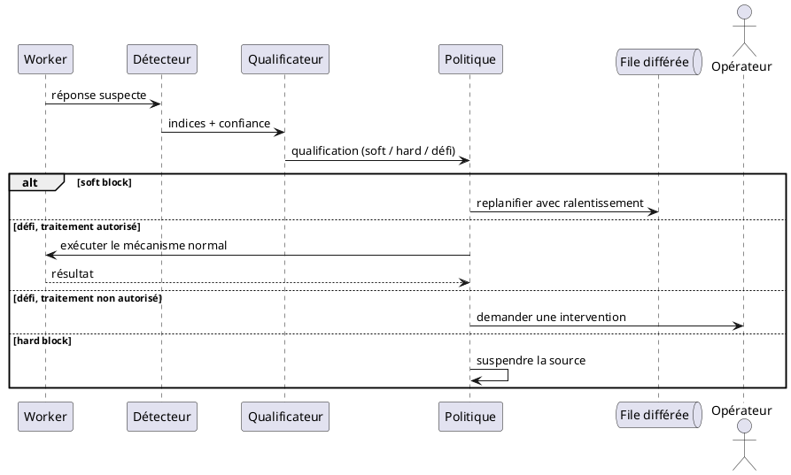

# 05 — Protections et réaction contrôlée

> **Groupe** : F (protections et réaction).
> **Prérequis** : `00-hub.md`, `04-moteur-navigation.md`.
> **Posture** : détecter, classifier et journaliser les protections rencontrées.
>
> **Outillage (cf. `08-stack-techno.md` §5).** Trois briques de ce groupe sont **à coder** — aucun outil dédié ne les porte : la **classification du *block subi* en sortie** (soft / hard, §2-§3) — les détecteurs de bots existants ciblent les attaquants *entrants* d'une infra, pas les blocages que le collecteur *subit* ; le **moteur de politique de réaction** (§4), arbre de décision métier ; la **qualification du contrôle d'environnement subi** (§5). Côté **signal d'automatisation** uniquement (qu'une page expose *sur nous*), une bibliothèque de fingerprinting (BotD / FingerprintJS, *à suivre*) peut alimenter l'analyse ; elle ne classe pas le block. L'**exécution** des réactions est portée par le moteur interne (Temporal) et déclenchée par le plan de contrôle (Dagster) — la **décision** reste ce code de politique.

---

## 1. Diagramme de composants



Trois sorties de réponse alimentent le détecteur : réponse HTTP directe, boucle d'événements du navigateur, réponse de soumission de formulaire.

---

## 2. Diagramme d'activité — détection et classification



Chaque détection produit une qualification enrichie, pas un simple drapeau binaire :

| Attribut de qualification | Rôle |
| --- | --- |
| Niveau de confiance | Probabilité que la protection soit bien celle détectée |
| Indices observés | Signaux ayant déclenché la détection |
| Classification provisoire | Catégorie retenue, révisable |
| Cause alternative possible | Hypothèse concurrente (ex. lenteur réelle plutôt que throttling) |

---

## 3. Qualification soft block / hard block

Distinction plus opératoire que le seul terme « blocage ».



| Restriction temporaire (soft) | Refus explicite (hard) |
| --- | --- |
| Ralentissement | Interdiction d'accès |
| Réponse dégradée | Suspension de compte |
| Limitation de fréquence | Adresse réseau bloquée |
| Attente artificielle | Page de refus persistante |
| Erreurs transitoires répétées | Authentification refusée |
| Contenu incomplet | Règles d'accès incompatibles |

---

## 4. Politique de réaction



Éventail des réactions autorisées :

```text
Protection détectée
├── respecter le délai demandé
├── réduire la fréquence
├── renouveler une session autorisée
├── exécuter le mécanisme client normal (si autorisé)
├── demander une intervention humaine
├── replanifier l'acquisition
├── suspendre la source
├── escalader (cran suivant de la cascade)
└── arrêter l'acquisition
```

> **POC vs gouvernance.** « Autorisé » renvoie ici à la **politique de réaction** (un composant), **pas** à une contrainte de collecte active au POC : au POC, **toute la cascade** est disponible sans contrainte — y compris l'**escalade** (furtif, managé, solveurs ; cf. `08-stack-techno.md` §4 et la règle immuable du POC). Le **gating par autorisation** (légalité / CGU / droit de réutilisation par source) relève de la **phase pré-production**, jamais du POC. L'escalade suit l'ordre de **coût croissant** de la cascade, pilotée par la qualification soft / hard (§3) : on n'escalade que si le contenu reste bloqué ou incomplet.

---

## 5. Qualification du contrôle d'environnement

Fingerprinting et contrôle comportemental sont détectés et classifiés.



Responsabilité face à un contrôle d'environnement : détecter, classifier, journaliser, appliquer la politique retenue, suspendre ou escalader.

---

## 6. Diagramme de séquence — défi détecté, réaction gouvernée



---

## 7. Tableau de couverture des protections

| Protection | Fonction prévue |
| --- | --- |
| CAPTCHA | Détection, pause, traitement autorisé ou intervention humaine |
| Proof of work | Détection, exécution normale si autorisée, contrôle du coût et du délai |
| Rate limiting | Respect des quotas, temporisation, replanification |
| Throttling | Réduction adaptative du rythme |
| Filtrage des agents clients | Détection du rejet, revue de compatibilité |
| Analyse comportementale | Limitation de concurrence, rythme cohérent, arrêt en cas de refus |
| Blocage d'adresse réseau | Détection, suspension de la source, revue |
| Jeton CSRF | Conservation de session, récupération du jeton avant soumission |
| Honeypot | Interaction uniquement avec les champs autorisés (fichier 04 § 12) |
| Validation serveur | Capture et classification technique, transfert des erreurs fonctionnelles |
| Détection d'environnement | Détection, classification, application de la politique autorisée |
| Défi JavaScript | Exécution dans le contexte de page si autorisé |
| Protection intermédiaire (WAF) | Qualification du blocage, arrêt, attente ou intervention |
| Validation de schéma | Validation avant envoi, qualification du rejet |
