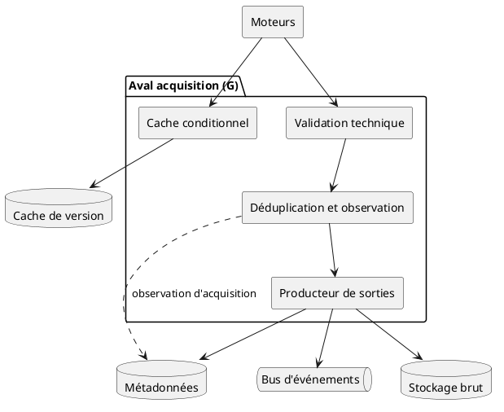
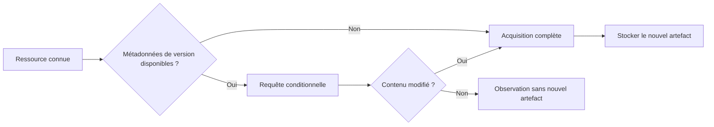
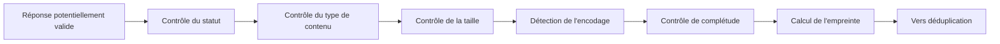
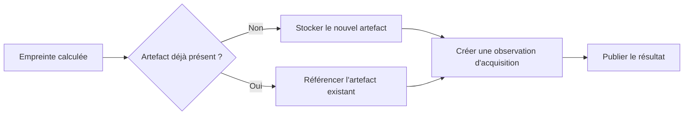
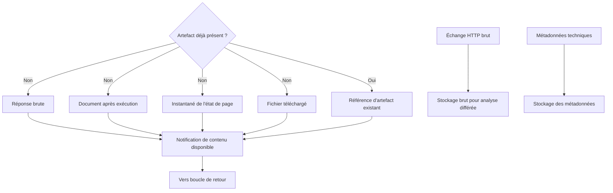

# 06 — Validation et artefacts

> **Groupe** : G (validation et artefacts).
> **Prérequis** : `00-hub.md`, `01-contrats-modele-donnees.md`.
> **Contenu** : validation technique, cache et requêtes conditionnelles, déduplication avec observation, sorties.

---

## 1. Diagramme de composants

---

## 2. Cache et requêtes conditionnelles

Éviter de télécharger intégralement un contenu inchangé. Le cache de version conserve les informations fournies par la source (validateurs de version, dates).

Fonctions : conservation des informations de version, requête conditionnelle, détection de contenu non modifié, politique de fraîcheur, cache de métadonnées, expiration, invalidation. Un contenu inchangé produit l'état `UNCHANGED` (fichier 01 § 9) et une observation, pas un nouvel artefact.

---

## 3. Validation technique minimale

Cette validation reste technique : statut, type, taille, encodage, intégrité, présence du document, empreinte. Elle ne supprime pas le bruit, n'interprète pas le sens, ne produit pas le modèle métier (frontière hub § 4).

---

## 4. Déduplication et observation

> **Décision verrouillée (hub § 6).** Même si l'empreinte existe déjà, le contenu n'est pas purement ignoré : une **observation d'acquisition** est toujours enregistrée. La déduplication évite de dupliquer l'artefact physique, pas de tracer l'exécution.

Trois notions distinctes :

| Notion | Contenu | Dédupliquée ? |
| --- | --- | --- |
| Artefact | Contenu physique (`artifact_id`, immuable) | Oui — réutilisé si empreinte connue |
| Exécution enregistrée | Observation : date, statut, latence, fraîcheur, conformité | Non — toujours enregistrée |
| Notification de résultat | Événement `document.acquired` ou équivalent | Non — toujours émise |

L'observation apporte : preuve que la source a été interrogée, nouvelle date de vérification, statut HTTP courant, évolution de latence, résultat de conformité, mise à jour de fraîcheur.

---

## 5. Sorties de l'acquisition

Artefacts produits, définis de façon disjointe (fichier 01 § 5) : réponse brute, document après exécution, instantané de l'état de page, fichier téléchargé. L'échange HTTP brut (fichier 01 § 6) est archivé en parallèle pour analyse différée. Ces sorties alimentent la couche extraction, pas un traitement métier interne.
