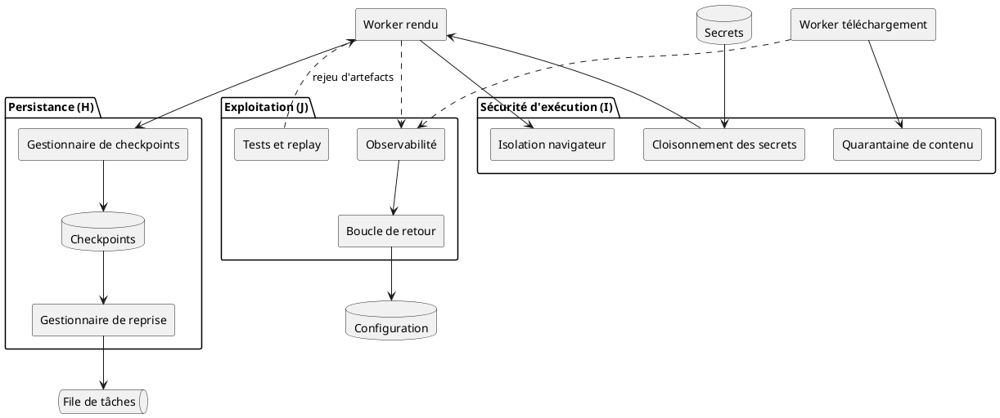
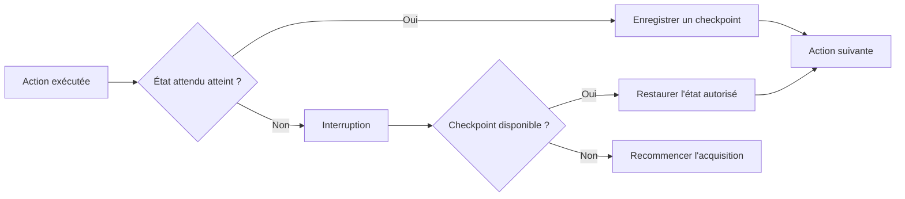
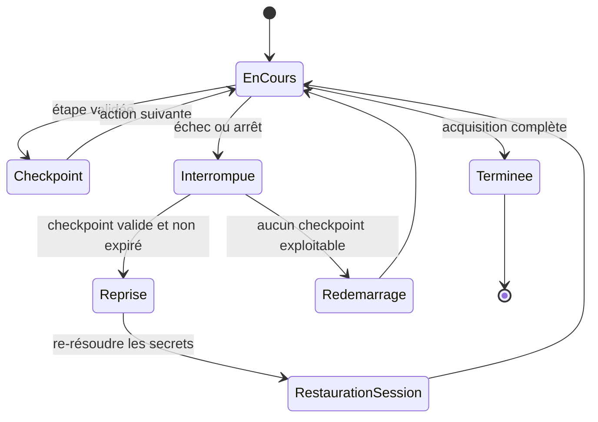
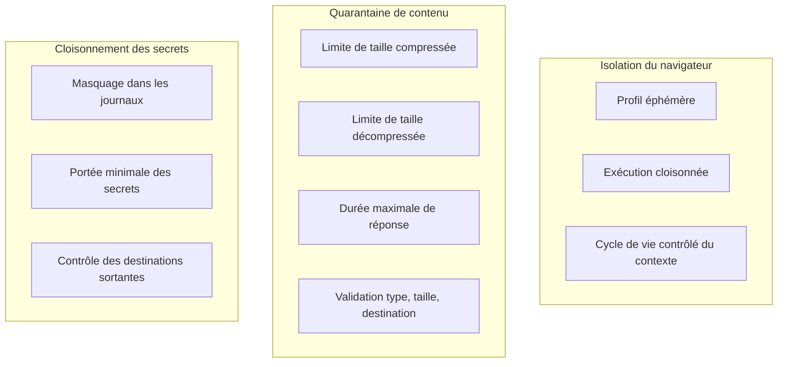
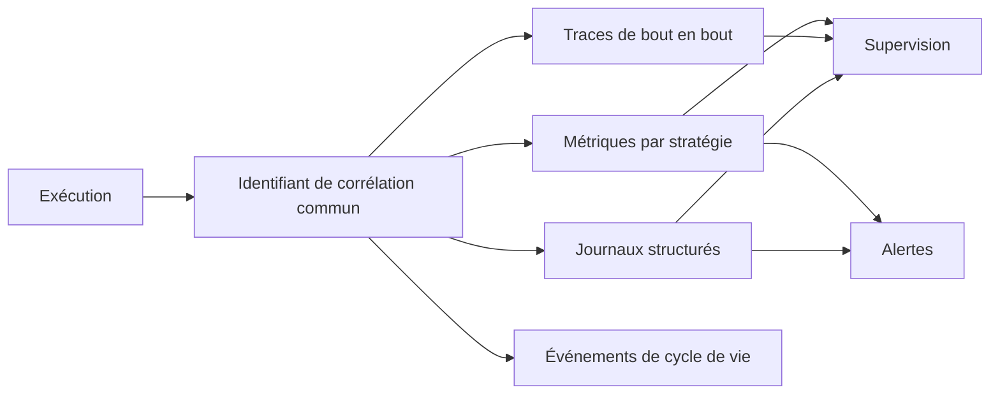
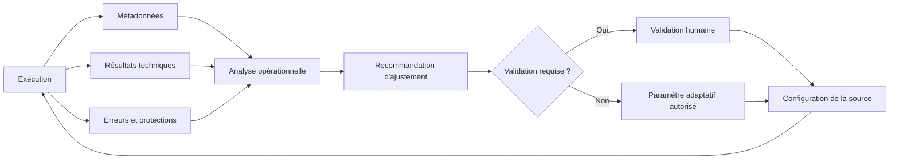
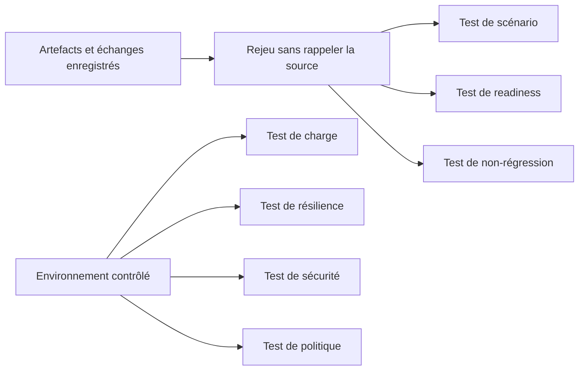
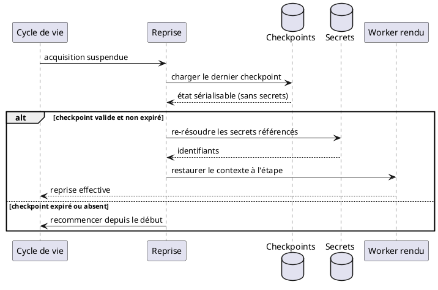

# 07 — Persistance, sécurité d'exécution et exploitation

> **Groupes** : H (persistance et reprise), I (sécurité d'exécution), J (exploitation).
> **Prérequis** : `00-hub.md`, `01-contrats-modele-donnees.md`, `03-session-reseau.md`.
> **Contenu** : checkpoints et reprise, isolation navigateur, quarantaine de contenu, cloisonnement des secrets, observabilité, boucle de retour, tests et replay.

---

## 1. Diagramme de composants



---

## 2. Persistance et checkpoints

Une navigation longue (SPA à nombreuses étapes) peut durer plusieurs minutes. Une reprise complète depuis le début est coûteuse.



Contenu d'un checkpoint (contrat fichier 01 § 7) : étape du scénario, route actuelle, ressources visitées, pagination atteinte, état de la frontière, fichiers déjà téléchargés, budget restant, dernière action validée.

> **Sécurité des secrets dans les checkpoints.** Aucun secret ni jeton de session sensible n'est sérialisé en clair. Les secrets sont référencés et re-résolus depuis le coffre à la reprise. La cohérence de session est rétablie via le mécanisme de renouvellement autorisé (fichier 03 § 5).

---

## 3. Diagramme d'état — reprise après interruption



---

## 4. Sécurité d'exécution

Compléments aux contrôles réseau du fichier 03 (anti-SSRF). Ici : isolation du moteur de rendu et maîtrise du contenu reçu.



| Risque | Contrôle |
| --- | --- |
| Exécution de script hostile | Isolation du navigateur, profil éphémère |
| Persistance navigateur | Cycle de vie contrôlé, profils jetables |
| Bombe zip | Limites de taille compressée et décompressée |
| Réponse infinie | Taille et durée maximales |
| Téléchargement malveillant | Quarantaine et analyse de contenu |
| Téléchargement automatique | Validation du type, de la taille, de la destination |
| Fuite de secrets | Cloisonnement, masquage des journaux |
| Exfiltration réseau | Contrôle des destinations sortantes |

---

## 5. Observabilité

Élément transverse, instrumenté sur toute la chaîne via le `correlation_id` (fichier 01).



| Dimension | Indicateurs |
| --- | --- |
| Métriques | Taux de blocage par source, taux de CAPTCHA, latence de readiness, taux d'escalade vers navigateur, coût moyen par acquisition, saturation des files, durée d'attente avant traitement, nombre de reprises, CPU et mémoire par acquisition, contextes de navigation actifs, taux de fermeture anormale, volume téléchargé, stockage consommé, artefacts réutilisés, dérive des conditions de readiness |
| Traces | Trace par acquisition, chaîne d'escalade, parcours de la frontière |
| Journaux | Détection et classification des protections, décisions de réaction, adaptations de contexte, avec cardinalité maîtrisée et journaux anonymisés |

### SLO possibles

```text
Disponibilité du service d'acquisition
Latence de démarrage d'une tâche
Taux de réussite par source
Taux de reprise réussie
Taux d'acquisitions sans navigateur
Temps moyen d'acquisition
Coût moyen par acquisition
Taux de publication des résultats
```

---

## 6. Boucle de retour gouvernée

Rend le système durable, en séparant les ajustements automatisables de ceux soumis à validation.



| Automatisable | Soumis à validation |
| --- | --- |
| Réduction de concurrence | Nouvelle méthode d'authentification |
| Augmentation contrôlée du délai | Changement de périmètre de collecte |
| Changement de condition d'attente | Modification des règles d'accès |
| Désactivation temporaire d'une source | Changement d'identité ou de chemin réseau |
| Priorité de la frontière | Traitement d'un challenge |
| Fréquence de rafraîchissement | Navigation vers de nouveaux domaines |
| Nombre de tentatives | — |

---

## 7. Tests, replay et non-régression



| Test | Objectif |
| --- | --- |
| Scénario | Vérifier les étapes de navigation |
| Readiness | Vérifier les conditions d'état prêt |
| Compatibilité | Vérifier les types de page supportés |
| Replay | Rejouer un échange enregistré |
| Non-régression | Détecter une modification de structure de la source |
| Charge | Vérifier la capacité des workers |
| Résilience | Simuler timeouts, erreurs, interruptions |
| Sécurité | Vérifier anti-SSRF, redirections, téléchargements |
| Politique | Vérifier les décisions de réaction |

La capture des échanges HTTP bruts (fichier 04 § 3) rend possible le **rejeu sans rappeler la source** : on teste l'extraction et les changements de scénario sur des échanges archivés, sans nouvelle sollicitation réseau.

---

## 8. Diagramme de séquence — reprise gouvernée d'une navigation interrompue



---

## 9. Synthèse de couverture

Rappel des décisions structurantes appliquées dans l'ensemble du blueprint.

| Élément | Traitement | Fichier |
| --- | --- | --- |
| Scope pages web (HTTP, rendu, fichier) | Trois moteurs, API/RSS exclus | 00, 04 |
| Capture HTTP brute pour analyse différée | Contrat `HttpExchange`, capture transverse | 01, 04 |
| Orchestration distribuée et cycle de vie | File, bail, machine d'état, idempotence | 02 |
| Anti-SSRF | Contrôle des adresses résolues, revalidation post-redirection | 03 |
| Adaptation de session et de contexte | Tableau de référence | 03, 00 §6 |
| Déduplication avec observation (pas de SKIP pur) | Artefact dédupliqué, exécution toujours enregistrée | 06, 00 §6 |
| Persistance et reprise | Checkpoints sans secrets en clair | 07 |
| Sécurité d'exécution | Isolation, quarantaine, cloisonnement | 07 |
| Observabilité, boucle de retour, tests | Corrélation, gouvernance, replay | 07 |
| Garde-fous de boucle | Plafond de tentatives, disjoncteur, budget | 02, 07 |
