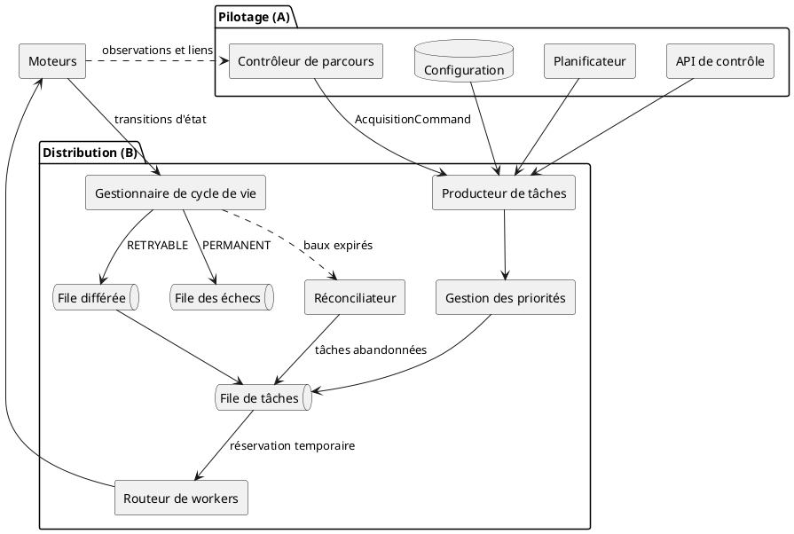
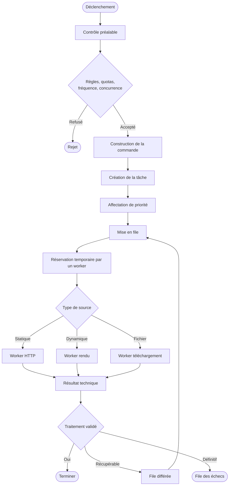
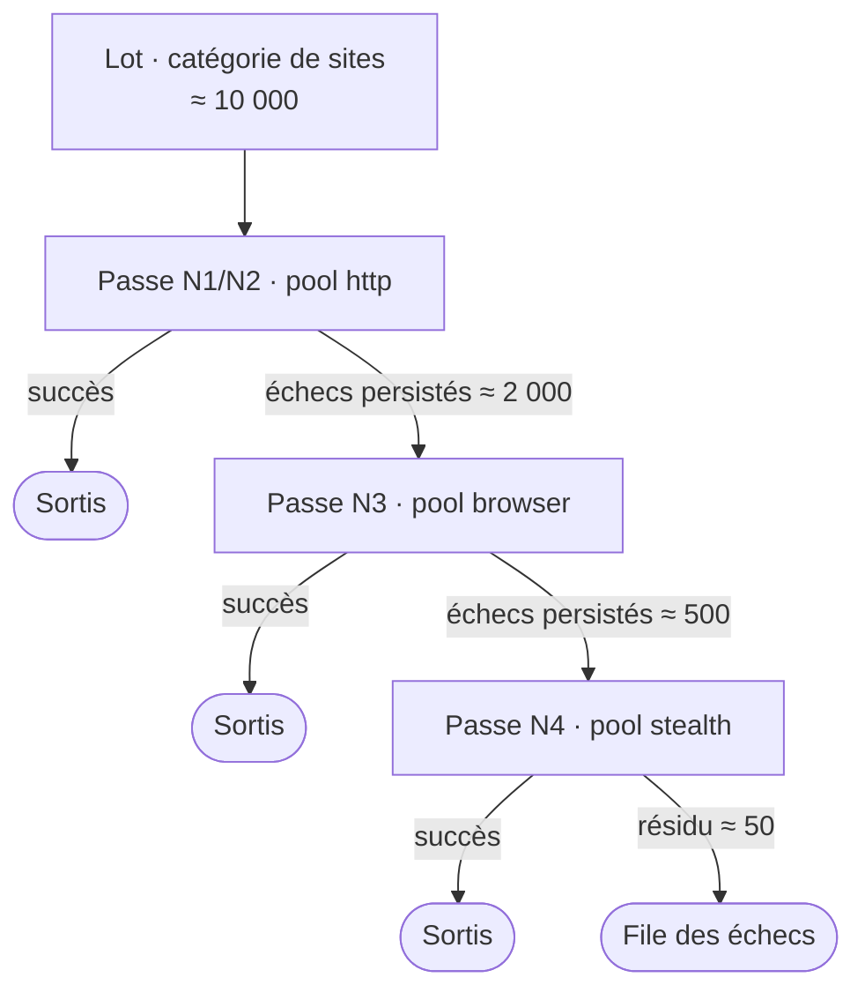
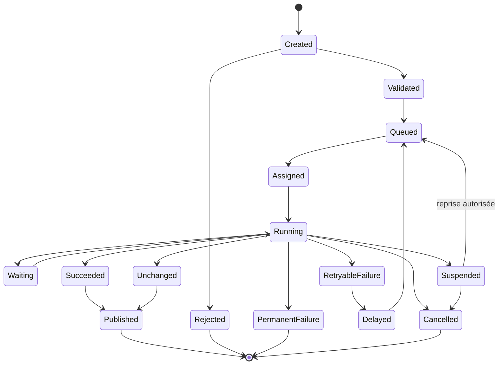
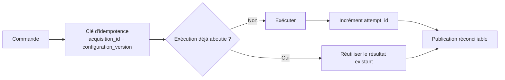
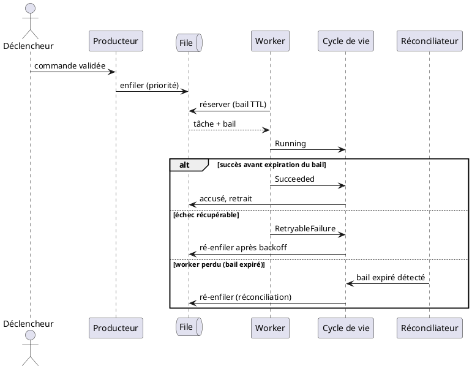
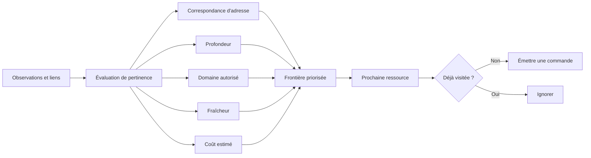
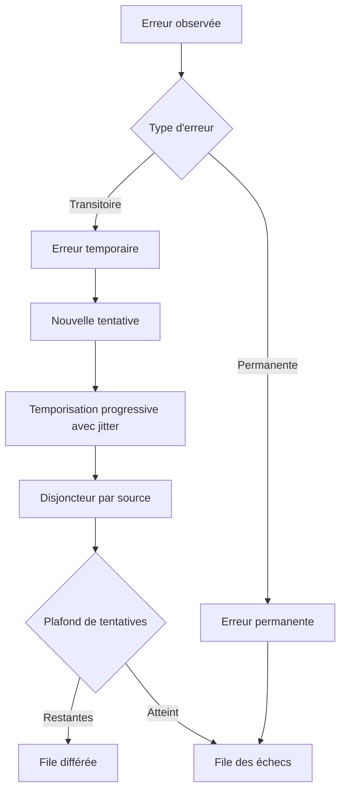

# 02 — Pilotage et distribution

> **Groupes** : A (pilotage et parcours), B (orchestration distribuée).
> **Prérequis** : `00-hub.md`, `01-contrats-modele-donnees.md`.
> **Contenu** : déclenchement, contrôleur de parcours, file de tâches, routage, tiers de workers, traitement par lots (tamis), cycle de vie, garanties de traitement, résilience.
>
> **Réalisation (cf. `08-stack-techno.md` + ADR module 0001)** : ce fichier décrit le *comportement attendu* du pilotage et de la distribution, indépendamment de l'outil. Concrètement, ces fonctions ne sont **pas à construire** : le **moteur interne est Temporal** (durable execution). File à baux, file différée, file des échecs (DLQ), accusé de traitement, idempotence, réconciliation et reprise (checkpoints) sont des **primitives natives, event-sourced** (groupe H « gratuit »). Les **workers** sont des **activités** Temporal en Python (toute I/O dans une activité = déterminisme). **Valkey** sert au **cache / sessions partagées** (plus broker). Le **déclenchement** vient du **plan de contrôle Dagster** (monorepo, ADR 0013) : pas de second ordonnanceur (ni Schedules Temporal, ni Beat).

---

## 1. Diagramme de composants

Le contrôleur de parcours et les moteurs sont séparés : le premier décide quoi visiter, les seconds exécutent. La boucle observations → parcours alimente la découverte sans fusionner les responsabilités.

---

## 2. Diagramme d'activité — du déclenchement à la terminaison

Fonctions de distribution couvertes : planification, file, priorité, réservation temporaire (bail), accusé de traitement, contrôle de concurrence, backpressure, répartition par capacité, mise à l'échelle, arrêt propre, file des échecs, réconciliation des tâches abandonnées. **Toutes ces fonctions sont natives Temporal** (cf. encart d'en-tête) — bail = *task lease*, réconciliation = *heartbeat / timeout*, file des échecs = DLQ event-sourced ; rien n'est à recoder. La **planification** (déclenchement) est, elle, externe : c'est **Dagster** (ADR 0013), pas un ordonnanceur interne.

Le routage de l'étape `ROUTE` (Statique → HTTP, Dynamique → rendu, Fichier → téléchargement) répartit chaque tâche **par capacité de worker**, pas par rang de cascade (cf. § 3 et § 4).

---

## 3. Tiers de workers (capacité, non rang)

Les workers sont segmentés en **trois pools** par **coût et capacité**, dimensionnés pour la volumétrie. Le **tag d'un worker = sa capacité technique**, **jamais le rang dans la cascade** d'escalade : le routeur (§ 2) et le tamis (§ 4) y adressent des tâches selon le besoin, pas selon une position figée.

| Pool | Capacité | Niveaux servis | Profil de mise à l'échelle |
| --- | --- | --- | --- |
| `http` | léger : httpx (N1) + curl_cffi (N2) | statique | scale massif, concurrence haute |
| `browser` | Chromium (rendu) | N3 | borné, RAM élevée |
| `stealth` | furtif (N4) | N4 | le plus petit, **isolé** (egress / proxies résidentiels dédiés, compteur de coût) |

Les pools sont **scalés indépendamment**. L'isolation du pool `stealth` sert surtout à cloisonner l'**egress** et les **proxies dédiés** et à porter un **compteur de coût** distinct.

---

## 4. Traitement par lots (tamis)

Modèle de **débit** complémentaire de l'escalade **par-URL** : une **catégorie de sites** forme un **lot** (par ex. 500 ou 10 000 sites) traité **niveau par niveau**. Le lot entier passe d'abord au niveau **le moins coûteux** (passe « normale » : N1/N2, pool `http`) ; les **succès sortent**, les **échecs sont persistés** et constituent l'**entrée de la passe supérieure** (`browser`, puis `stealth`), passe après passe.

**Funnel observable** (ex. 10 000 → 2 000 → 500 → 50). Avantages :

- **maximise** la part traitée au niveau *cheap* avant d'engager les niveaux chers ;
- **batche** les ressources coûteuses (le pool `stealth` n'est lancé qu'une fois une vraie **fournée** constituée) ;
- **révision et scheduling indépendants** par niveau ;
- les **listes d'échecs** de chaque passe sont des **artefacts persistés**.

**Réalisation Temporal** : un niveau = une **itération** de workflow ; le passage au niveau supérieur se fait par **`continue-as-new`** sur la **liste d'échecs** (le résidu qui rétrécit à chaque passe). La file, les baux et la DLQ restent natifs (encart d'en-tête).

### Coexistence avec l'escalade par-URL

Les deux régimes **coexistent** et adressent les mêmes tiers (§ 3) :

| Régime | Optimise | Mécanique |
| --- | --- | --- |
| **Escalade par-URL** | latence par site | un workflow grimpe la cascade jusqu'au succès |
| **Tamis par-lots** | débit · observabilité · batch des ressources chères | passes successives sur le résidu d'échecs |

> Une évaluation **Windmill** a servi à comparer l'approche (fan-out déclaratif + partition des échecs) ; le **moteur du module reste Temporal** (ADR module 0001).

---

## 5. Machine d'état du cycle de vie

État canonique d'une acquisition, aligné sur les `final_status` du fichier 01. Cette FSM se modélise **« as code »** dans **Temporal** (corps de workflow) avec des modèles **Pydantic** pour les états et transitions ; la file durable qui la porte (bail, DLQ, réconciliation) est **native Temporal**, pas un composant à construire.

### Attributs de transition

Chaque transition précise : acteur responsable, délai maximal, événement produit, possibilité de reprise, compteur de tentatives, motif de transition, conservation des artefacts intermédiaires.

| Transition | Acteur | Borne | Événement |
| --- | --- | --- | --- |
| `Created → Validated` | Contrôle préalable | — | `acquisition.validated` |
| `Assigned → Running` | Worker (bail acquis) | TTL de bail | `acquisition.started` |
| `Running → Waiting` | Worker (attente d'état prêt) | timeout | — |
| `Running → RetryableFailure` | Worker | — | `acquisition.retry` |
| `RetryableFailure → Delayed` | Cycle de vie | backoff | — |
| `Delayed → Queued` | Cycle de vie | délai écoulé | `acquisition.requeued` |
| `Running → Suspended` | Worker (checkpoint) | TTL checkpoint | `acquisition.suspended` |
| `Succeeded → Published` | Sorties | — | `document.acquired` |

---

## 6. Idempotence et garanties

Principe : une nouvelle tentative réutilise `acquisition_id` et `execution_id`, n'incrémente que `attempt_id`, et ne crée jamais une nouvelle acquisition logique. La publication est réconciliable, de sorte qu'un événement émis deux fois ne produit pas de doublon en aval.

---

## 7. Diagramme de séquence — réservation, exécution, accusé

Dialogue entre file, worker et cycle de vie, avec gestion du bail.

Le bail (réservation temporaire) protège contre la perte d'un worker : si l'accusé n'arrive pas avant l'expiration, le réconciliateur ré-enfile la tâche. Couplé à l'idempotence (§ 6), cela donne une sémantique « au moins une fois » sans double effet. **En pratique, Temporal fournit ce schéma nativement** : le bail et la réconciliation correspondent au *heartbeat* d'activité et au *timeout*, la ré-exécution étant rejouée depuis l'historique event-sourced.

---

## 8. Contrôleur de parcours

Découplé des moteurs. Gère la frontière priorisée et la boucle de découverte.

Responsabilités de la frontière : priorité, profondeur maximale, domaine autorisé, canonicalisation des adresses, détection des cycles, budget de pages, budget temporel, coût d'exécution estimé, fraîcheur attendue, reprise après erreur.

---

## 9. Résilience

> **Garde-fous obligatoires** : compteur de tentatives plafonné (`max_attempts`), disjoncteur par source pour suspendre une source défaillante, budget temporel par acquisition. Toute boucle de replanification est bornée — pas de réinjection infinie.
