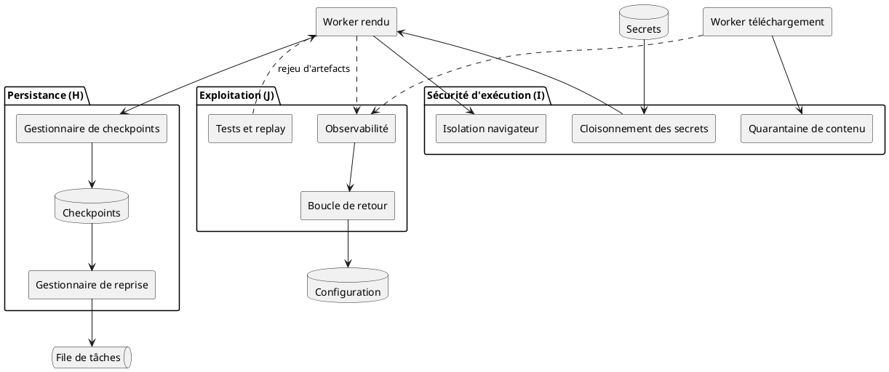
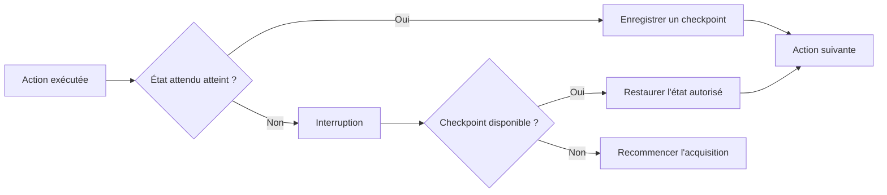
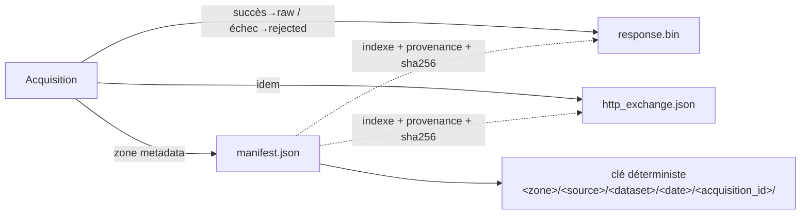
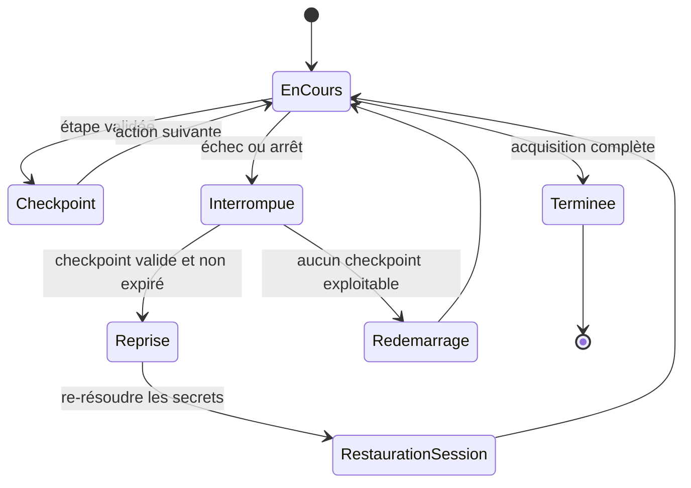
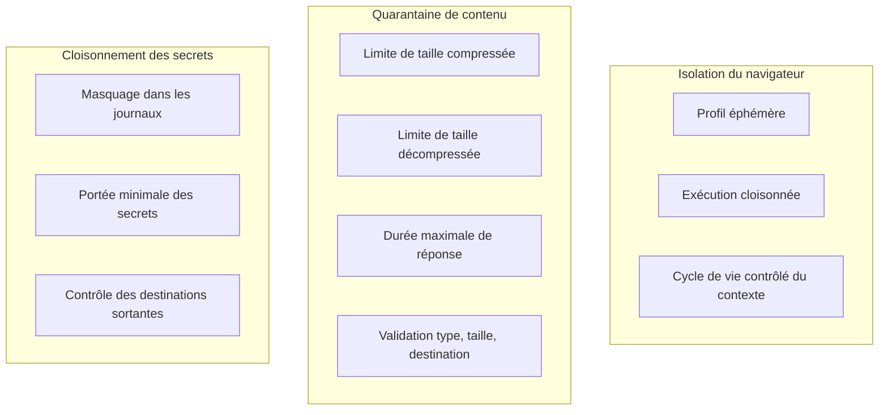
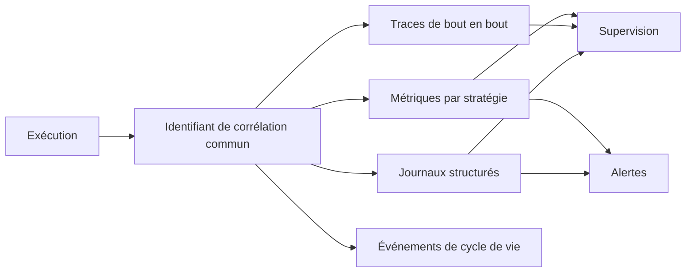
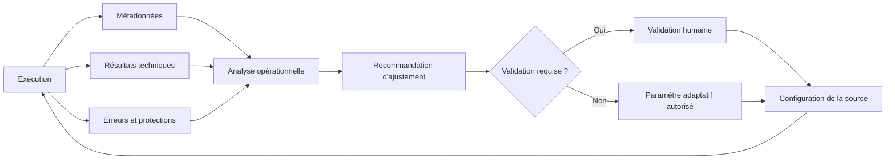
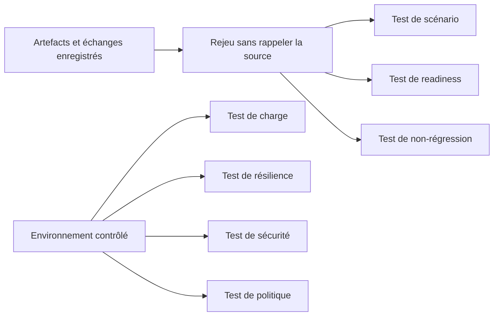
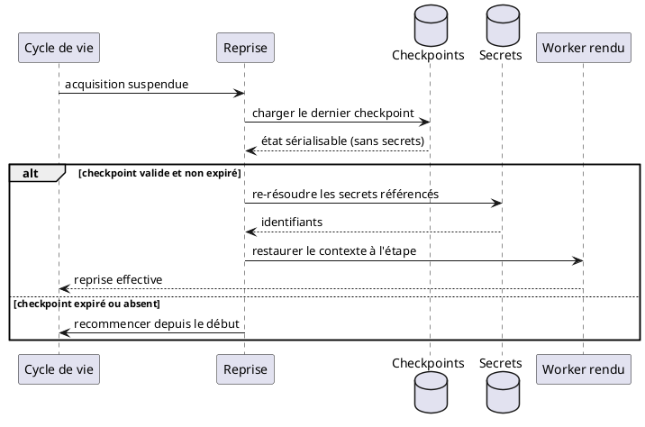

# 07 — Persistance, sécurité d'exécution et exploitation

> **Groupes** : H (persistance et reprise), I (sécurité d'exécution), J (exploitation).
> **Prérequis** : `00-hub.md`, `01-contrats-modele-donnees.md`, `03-session-reseau.md`.
> **Contenu** : checkpoints et reprise, modèle de stockage RAW (triplet + sink), isolation navigateur, quarantaine de contenu, cloisonnement des secrets, observabilité, boucle de retour, tests et replay.

---

## 1. Diagramme de composants



---

## 2. Persistance et checkpoints

Une navigation longue (SPA à nombreuses étapes) peut durer plusieurs minutes. Une reprise complète depuis le début est coûteuse.

> **Mécanisme = Temporal natif (event-sourced), pas un store maison.** La reprise (groupe H) est **gratuite** : l'**historique du workflow Temporal EST le checkpoint** (moteur interne, fichier 08 + ADR module 0001). L'**état de la frontière** (`frontier_state`), l'état sérialisable et les ressources visitées sont donc **quasi implicites** (rejoués depuis l'historique), avec **idempotence** (activity-id sur `acquisition_id + configuration_version`) et **réconciliation** (heartbeat) **natives** — au lieu d'être codés à la main. Le « Gestionnaire de checkpoints » et la base « Checkpoints » des diagrammes sont donc une **vue logique** de ce mécanisme natif ; un store local complémentaire (ex. **redb**) reste optionnel, **jamais** le store de checkpoints principal.



Contenu d'un checkpoint (contrat fichier 01 § 7) : étape du scénario, route actuelle, ressources visitées, pagination atteinte, état de la frontière, fichiers déjà téléchargés, budget restant, dernière action validée.

> **Secrets dans les checkpoints.** Aucun secret ni jeton de session sensible n'est sérialisé en clair : les secrets sont **référencés** puis **re-résolus** à la reprise depuis leur source de configuration (au **POC** : variables d'environnement / fichiers Compose ; coffre dédié = **pré-production**, §5). La cohérence de session est rétablie via le mécanisme de renouvellement autorisé (fichier 03 § 5).

---

## 3. Modèle de stockage RAW

> **Frontière de couche.** Le module est un **producteur de raw** : il écrit dans les zones `raw` /
> `rejected` / `metadata` du lac, **jamais** dans Postgres / Qdrant / Neo4j. C'est `02_transform`
> (monorepo) qui **lit le raw** et alimente la vérité Postgres + projections ; les zones aval
> (`staging` / `curated` / `serving`) lui appartiennent.

### Le lac et ses zones

Un **bucket unique `lake`**, structuré en **zones** (préfixes) — modèle de data-lake :

| Zone | Responsabilité | Écrite par |
| --- | --- | --- |
| `landing` | Réception temporaire | ingestion |
| **`raw`** | Donnée source originale, **immuable** | **acquisition (succès)** |
| `staging` | Parsing et nettoyage technique | `02_transform` |
| `curated` | Donnée normalisée et validée métier | `02_transform` |
| `serving` | Formats optimisés (API, BI, recherche) | `02_transform` |
| **`rejected`** | Erreurs, données invalides, **quarantaine** | **acquisition (échec)** |
| **`metadata`** | **Manifests**, lignage, schémas, métriques | **acquisition (manifest)** |

Le **lac est une infra PARTAGÉE** (`compose.infra.yaml`, réseau externe `carto_lake`) : un seul
SeaweedFS au POC ↔ **Ceph RGW** en prod (même API S3), commun à Temporal **et** Windmill — jamais
« possédé » par un orchestrateur. Bucket + zones sont **provisionnés automatiquement et
idempotemment** par le service `lake-init` (`docker/lake/zones.json` + `init_lake.py`).

### Contrat raw : triplet routé par zone

Chaque acquisition produit un **triplet**, clé objet
`<zone>/<source>/<dataset>/<YYYY-MM-DD>/<acquisition_id>/<name>`, la **zone selon l'issue** :

```text
# succès (SUCCESS / UNCHANGED)              # échec (BLOCKED / PERMANENT / RETRYABLE)
lake/raw/…/<id>/response.bin                lake/rejected/…/<id>/response.bin
lake/raw/…/<id>/http_exchange.json         lake/rejected/…/<id>/http_exchange.json
lake/metadata/…/<id>/manifest.json         lake/metadata/…/<id>/manifest.json
```

- **`response.bin`** / **`http_exchange.json`** → zone **`raw`** (succès) ou **`rejected`** (échec, quarantaine) : corps brut octet pour octet + échange HTTP complet (`HttpExchange`, fichier 04 § 3 : `method`, `url`, `final_url`, `status`, en-têtes, `timings`, `protocol`).
- **`manifest.json`** → zone **`metadata`** (toujours) : l'**index** de l'acquisition (`acquisition_id`, `final_state`, `mode`, `artifacts` [`kind`, `content_type`, `size`, `sha256`, `key`, `uri`], `http_exchange`, `observed_at`) + la **provenance**. Il **référence** ses artefacts data (clés en `raw/` ou `rejected/`) — **zone des données ≠ zone du manifest**.

`acquisition_id = sha256(url + "|" + configuration_version)[:16]` — **identique quel que soit le moteur** (Go / TS / Python, et l'évaluation Windmill). La clé objet en découle, donc **déterministe et rejouable**. Le `sha256` de chaque artefact sert l'**intégrité** et la **déduplication** (déduplication avec observation, fichier 06).



### Sink interchangeable (local ↔ S3)

Le backend est **swappable** (`cmd/acquire -sink local|s3`), la **clé objet restant identique** :

| Sink | URI | Usage |
| --- | --- | --- |
| **local** | `file://` → dossier `data/` | dev / jetable |
| **S3** | `s3://lake/<zone>/…` | **store objet partagé (le lac)** |

Pour le sink S3, le store est **interchangeable derrière la même API S3** : au **POC**, **SeaweedFS** (le **lac partagé**, `compose.infra.yaml`, réseau `carto_lake`) ; en **production**, **Ceph RGW** (cible, **ADR 0007 inchangé**, **même API S3**). Le passage local → SeaweedFS → Ceph RGW ne change ni le contrat raw, ni la clé, ni le routage par zone.

---

## 4. Diagramme d'état — reprise après interruption



---

## 5. Sécurité d'exécution

> **Phase pré-production — PAS une contrainte du POC.** Coffre à secrets, anti-SSRF / contrôle d'egress, sandbox OS et masquage PII relèvent de la **phase pré-production** (pour plus tard ; dépend des pays cibles). Au **POC**, les secrets passent par **variables d'environnement / fichiers Compose** (le coffre type Vault/OpenBao/SOPS est « En attente », fichier 08 §5) ; **Gitleaks** assure l'**hygiène secrets** (il détecte une fuite, **ne stocke pas** — ce n'est **pas** un coffre). Cette section décrit la **cible**, pas un contrôle actif au POC.

Compléments aux contrôles réseau du fichier 03 (anti-SSRF). Ici : isolation du moteur de rendu et maîtrise du contenu reçu.



| Risque | Contrôle |
| --- | --- |
| Exécution de script hostile | Isolation du navigateur, profil éphémère |
| Persistance navigateur | Cycle de vie contrôlé, profils jetables |
| Bombe zip | Limites de taille compressée et décompressée |
| Réponse infinie | Taille et durée maximales |
| Téléchargement malveillant | Quarantaine et analyse de contenu |
| Téléchargement automatique | Validation du type, de la taille, de la destination |
| Fuite de secrets | Cloisonnement, masquage des journaux |
| Exfiltration réseau | Contrôle des destinations sortantes |

---

## 6. Observabilité

Élément transverse, instrumenté sur toute la chaîne via le `correlation_id` (fichier 01).

> **Pile cible.** Instrumentation = **OpenTelemetry** (`correlation_id` bout-en-bout). Backends = **VictoriaMetrics** (métriques + alertes), **VictoriaLogs** (journaux), **Tempo** (traces), **Grafana** (dashboards). Victoria est **préféré** : plus efficient en RAM/disque, **mature**, exploitation simple, et **licence Apache-2.0** — il **remplace** Prometheus/Mimir (métriques) et Loki (journaux). De ce fait, **la réserve de licence AGPL côté backend est levée**. Cette pile est la **couche 03 (observabilité)**, **optionnelle** au POC (scaffold activable à la demande).



| Dimension | Indicateurs |
| --- | --- |
| Métriques | Taux de blocage par source, taux de CAPTCHA, latence de readiness, taux d'escalade vers navigateur, coût moyen par acquisition, saturation des files, durée d'attente avant traitement, nombre de reprises, CPU et mémoire par acquisition, contextes de navigation actifs, taux de fermeture anormale, volume téléchargé, stockage consommé, artefacts réutilisés, dérive des conditions de readiness |
| Traces | Trace par acquisition, chaîne d'escalade, parcours de la frontière |
| Journaux | Détection et classification des protections, décisions de réaction, adaptations de contexte, avec cardinalité maîtrisée et journaux anonymisés |

### SLO possibles

```text
Disponibilité du service d'acquisition
Latence de démarrage d'une tâche
Taux de réussite par source
Taux de reprise réussie
Taux d'acquisitions sans navigateur
Temps moyen d'acquisition
Coût moyen par acquisition
Taux de publication des résultats
```

---

## 7. Boucle de retour gouvernée

Rend le système durable, en séparant les ajustements automatisables de ceux soumis à validation.



| Automatisable | Soumis à validation |
| --- | --- |
| Réduction de concurrence | Nouvelle méthode d'authentification |
| Augmentation contrôlée du délai | Changement de périmètre de collecte |
| Changement de condition d'attente | Modification des règles d'accès |
| Désactivation temporaire d'une source | Changement d'identité ou de chemin réseau |
| Priorité de la frontière | Traitement d'un challenge |
| Fréquence de rafraîchissement | Navigation vers de nouveaux domaines |
| Nombre de tentatives | — |

---

## 8. Tests, replay et non-régression



| Test | Objectif |
| --- | --- |
| Scénario | Vérifier les étapes de navigation |
| Readiness | Vérifier les conditions d'état prêt |
| Compatibilité | Vérifier les types de page supportés |
| Replay | Rejouer un échange enregistré |
| Non-régression | Détecter une modification de structure de la source |
| Charge | Vérifier la capacité des workers |
| Résilience | Simuler timeouts, erreurs, interruptions |
| Sécurité | Vérifier anti-SSRF, redirections, téléchargements |
| Politique | Vérifier les décisions de réaction |

La capture des échanges HTTP bruts (fichier 04 § 3) rend possible le **rejeu sans rappeler la source** : on teste l'extraction et les changements de scénario sur des échanges archivés, sans nouvelle sollicitation réseau.

---

## 9. Diagramme de séquence — reprise gouvernée d'une navigation interrompue



---

## 10. Synthèse de couverture

Rappel des décisions structurantes appliquées dans l'ensemble du blueprint.

| Élément | Traitement | Fichier |
| --- | --- | --- |
| Scope pages web (HTTP, rendu, fichier) | Trois moteurs, API/RSS exclus | 00, 04 |
| Capture HTTP brute pour analyse différée | Contrat `HttpExchange`, capture transverse | 01, 04 |
| Orchestration distribuée et cycle de vie | File, bail, machine d'état, idempotence | 02 |
| Anti-SSRF | Contrôle des adresses résolues, revalidation post-redirection | 03 |
| Adaptation de session et de contexte | Tableau de référence | 03, 00 §6 |
| Déduplication avec observation (pas de SKIP pur) | Artefact dédupliqué, exécution toujours enregistrée | 06, 00 §6 |
| Persistance et reprise | Reprise **event-sourced Temporal** (checkpoints natifs, sans secrets en clair) | 07, 08 |
| Stockage RAW (frontière de couche) | Triplet `manifest`/`response`/`http_exchange`, clé objet déterministe, sink local↔S3 (POC SeaweedFS · prod Ceph RGW) | 07, 01, 04 |
| Sécurité d'exécution | Isolation, quarantaine, cloisonnement — **cible pré-production**, pas une contrainte POC | 07 |
| Observabilité, boucle de retour, tests | Corrélation, gouvernance, replay | 07 |
| Garde-fous de boucle | Plafond de tentatives, disjoncteur, budget | 02, 07 |
