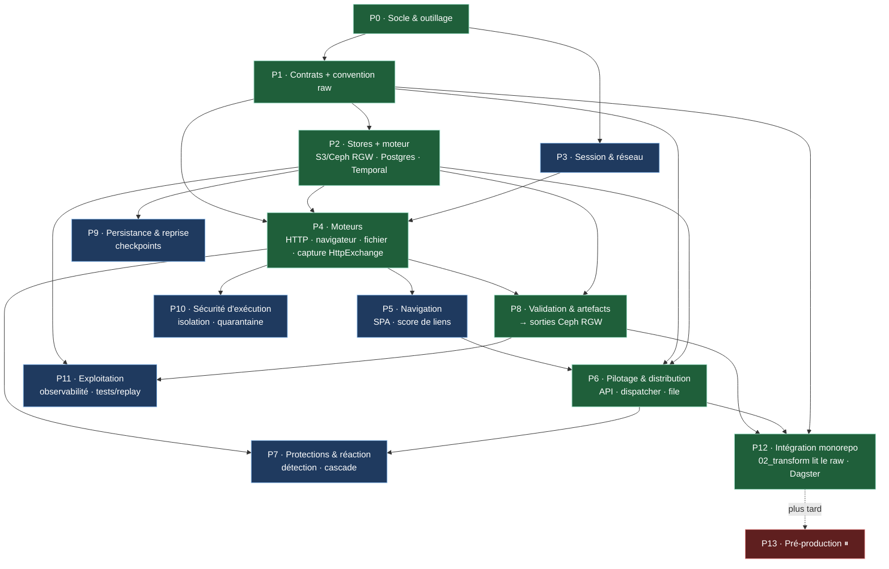

# Étapes — matrice checkliste de création du module `web-scraping`

> Feuille de route de **construction du module** (du squelette actuel → MVP → architecture cible). S'appuie sur
> le blueprint [`00-hub.md`](00-hub.md) (groupes **A–J**), les contrats [`01-contrats-modele-donnees.md`](01-contrats-modele-donnees.md)
> et la stack [`08-stack-techno.md`](08-stack-techno.md).
>
> **Légende** — `[ ]` à faire · `[~]` en cours · `[x]` fait.
> **Priorité** — **MVP** (premier déploiement, 5 services hub §7) · **V1** (architecture cible) · **⏸ Pré-prod** (différé, cf. règle immuable).
> **POC sans contrainte** : toute la cascade (furtif/managé/solveurs) est disponible ; sécurité / légalité / RGPD = phase pré-production.

## État actuel (fait)

- [x] Repo `na-web-scraping` créé, poussé, monté en **submodule** (`modules/web-scraping/`).
- [x] Blueprint complet (`00-hub` → `07`, contrats, stratégie, audit) + `08-stack-techno`.
- [x] Squelette `src/web_scraping/` (paquets par groupe A–J), `pyproject.toml`, `docker-compose.yml`, `.gitignore`, `tests/`.
- [x] Stack tranchée : **httpx**, Playwright, Scrapy, **Temporal** (moteur durable) + PostgreSQL + Valkey (cache/sessions), Ceph RGW, Pydantic, warcio, OpenTelemetry, briques (hashlib/blake3, filetype, charset-normalizer, Hishel, boto3). *(Temporal remplace Celery — ADR module 0001.)*

---

## Pipeline de construction (vue d'ensemble)

Les phases forment un **graphe de dépendances** (pas une simple liste) : on peut paralléliser les branches.
🟢 = chemin critique **MVP** · 🔵 = **V1** (cible) · 🔴 = **⏸ pré-prod** (différé).

**Chemin critique MVP** (séquence minimale livrable) :
`P0 Socle → P1 Contrats → P2 Stores → P4 Moteurs (HTTP + navigateur + capture) → P8 Validation/sorties → P6 API+dispatcher → P12 lecture par 02_transform`.
Branches **parallélisables** une fois P2/P4 en place : P5 (navigation), P7 (protections), P9 (reprise), P10 (sécu exécution), P11 (exploitation).

---

## Phase 0 — Socle projet & outillage

| ✓ | Étape / livrable | Techno | Dépend de | Priorité |
|---|---|---|---|---|
| [ ] | Dépendances dans `pyproject.toml` (httpx, scrapy, playwright, celery, pydantic, boto3, warcio, opentelemetry…) | uv | — | **MVP** |
| [ ] | Lockfile + sync (`uv lock` / `uv sync`) | uv | deps | **MVP** |
| [ ] | Config qualité : `ruff`, `mypy`, `pytest` (déjà esquissés dans pyproject) | ruff/mypy/pytest | — | **MVP** |
| [ ] | `Makefile` (install, lint, test, up, down) + `.env.example` | make | — | **MVP** |
| [ ] | `playwright install` (navigateurs) dans l'image | Playwright | deps | **MVP** |
| [ ] | `docker-compose.yml` : services MVP (`acquisition-api`, `-dispatcher`, `-http-worker`, `-browser-worker`, `-storage`) | Compose | — | **MVP** |
| [ ] | Compose : **Temporal** (serveur + DB) + **Valkey** (cache/sessions) + réseau **`carto_net`** (externe) | Temporal/Valkey | 00_infra (monorepo) | **MVP** |
| [ ] | CI lint+test (optionnel) | — | qualité | V1 |

## Phase 1 — Contrats & modèle de données (groupe transverse, fichier 01)

| ✓ | Étape / livrable | Techno | Dépend de | Priorité |
|---|---|---|---|---|
| [ ] | Modèles `AcquisitionCommand` / `AcquisitionResult` / `Artifact` / `HttpExchange` / `Checkpoint` | Pydantic | Phase 0 | **MVP** |
| [ ] | Identifiants & idempotence (`acquisition_id` dérivé de `resource_id`+`configuration_version`) | Pydantic | contrats | **MVP** |
| [ ] | États finaux normalisés (`SUCCESS`/`UNCHANGED`/`RETRYABLE`/`PERMANENT`/`BLOCKED`) | Python | contrats | **MVP** |
| [ ] | **Convention de clé / manifest raw** → Ceph RGW (contrat de sortie vers le monorepo, ADR 0021/0007) | — | contrats | **MVP** |
| [ ] | Validation des contrats (tests) | pytest | contrats | V1 |

## Phase 2 — Plomberie & stores (`platform`)

| ✓ | Étape / livrable | Techno | Dépend de | Priorité |
|---|---|---|---|---|
| [ ] | Client objet S3 → **Ceph RGW** (`raw/` : artefacts + HttpExchange) | boto3 | P1 (clé/manifest) | **MVP** |
| [ ] | Base métadonnées (config sources, index dédup par empreinte, observations) | PostgreSQL | P1 | **MVP** |
| [ ] | **Temporal** : serveur + workers Python (**activités**) ; file / retries / idempotence / checkpoints **natifs** | Temporal | P0, P1 | **MVP** |
| [ ] | Hash / empreinte de contenu | hashlib (blake3) | — | **MVP** |
| [ ] | Coffre à secrets (au POC : env / fichiers Compose ; coffre réel = pré-prod) | env | — | ⏸ Pré-prod |

## Phase 3 — Session & réseau (groupe C)

| ✓ | Étape / livrable | Techno | Dépend de | Priorité |
|---|---|---|---|---|
| [ ] | Couche réseau : pools de connexions, timeouts, DNS/TLS, redirections | httpx | P2 | **MVP** |
| [ ] | Gestion de session (cookies, jetons, état, ré-auth) | httpx/Playwright | — | V1 |
| [ ] | Contrôle des sorties (egress) / **anti-SSRF** / DNS pinné (à coder) | code | — | V1 |
| [ ] | Adaptation du contexte (compat + cascade ; **POC : libre**) | httpx/curl_cffi | — | V1 |

## Phase 4 — Moteurs d'acquisition (groupe D)

| ✓ | Étape / livrable | Techno | Dépend de | Priorité |
|---|---|---|---|---|
| [ ] | **Worker HTTP statique** (requête, redirections, `raw_response`) | httpx | P2, P3 | **MVP** |
| [ ] | **Worker rendu navigateur** (JS, document vivant, `rendered_document`/`page_snapshot`) | Playwright | P2 | **MVP** |
| [ ] | Worker **téléchargement de fichier** (`downloaded_file`, contrôle taille/type) | httpx | P2 | **MVP** |
| [ ] | **Capture HTTP brute** (`HttpExchange` req/resp + timings) → Ceph RGW | httpx/Playwright (HAR) | P1, P2 | **MVP** |
| [ ] | Sélection du mode (statique → navigateur, escalade de coût) | code | moteurs | V1 |
| [ ] | Socle de crawl HTTP (ordonnancement, AutoThrottle, file d'URLs) | Scrapy (+Scrapy-Playwright) | moteurs | V1 |

## Phase 5 — Navigation (groupe E)

| ✓ | Étape / livrable | Techno | Dépend de | Priorité |
|---|---|---|---|---|
| [ ] | État « prêt » (combinaison de conditions) + diagnostic de timeout | Playwright | P4 | V1 |
| [ ] | Modes de navigation (guidé / sémantique / découverte / scénario) | code | P4 | V1 |
| [ ] | SPA, shadow DOM, iframes, scroll infini, contenu virtualisé | Playwright | P4 | V1 |
| [ ] | **Découverte par score** (analyse de page **pour naviguer** : liens, frontière priorisée) | parsel/selectolax | P4 | V1 |
| [ ] | Formulaires (champs autorisés, jetons, soumission) | Playwright | P4 | V1 |

## Phase 6 — Pilotage & distribution (groupes A, B)

| ✓ | Étape / livrable | Techno | Dépend de | Priorité |
|---|---|---|---|---|
| [ ] | **API de contrôle** / soumission de commandes (`acquisition-api`) | FastAPI/httpx | P1 | **MVP** |
| [ ] | **Routage par capacité** (task queues Temporal : http / browser / file) | Temporal | P2 | **MVP** |
| [ ] | File / priorité / réservation/bail / backpressure / **file différée** / **DLQ** = **natifs Temporal** | Temporal | P2 | V1 |
| [ ] | Machine d'état (cycle de vie) + garanties (au-moins-une-fois + workers idempotents) | code | P1 | V1 |
| [ ] | Contrôleur de parcours (frontière, priorités, profondeur, budgets, couverture) | code | P5 | V1 |
| [ ] | Contrôle préalable (quotas, fréquence, concurrence) + circuit-breaker/backoff | code | — | V1 |
| [ ] | **Déclenchement / capture par Dagster** (côté monorepo : sensor / commande) | Dagster | P2, contrat raw | V1 |

## Phase 7 — Protections & réaction (groupe F) — *POC : cascade complète disponible*

| ✓ | Étape / livrable | Techno | Dépend de | Priorité |
|---|---|---|---|---|
| [ ] | Détection (CAPTCHA / WAF / throttling / challenge / environnement) | BotD (côté page) | P4 | V1 |
| [ ] | Qualification du block subi (soft / hard, confiance) — à coder | code | détection | V1 |
| [ ] | Politique de réaction (ralentir / replanifier / **escalader la cascade** / arrêter) | code | P6 | V1 |
| [ ] | Cascade d'escalade : impersonation (curl_cffi), furtif (Camoufox/nodriver/Patchright), managé, solveurs | cf. strategie-anti-bot | moteurs | V1 |

## Phase 8 — Validation & artefacts (groupe G)

| ✓ | Étape / livrable | Techno | Dépend de | Priorité |
|---|---|---|---|---|
| [ ] | Validation **technique** (statut, type, taille, encodage, intégrité, empreinte) | Pydantic + filetype + charset-normalizer | P1 | **MVP** |
| [ ] | Cache conditionnel (ETag / If-Modified-Since, détection 304) | Hishel | P3 | V1 |
| [ ] | Déduplication par empreinte **+ observation toujours enregistrée** (hub §6) | hashlib + Postgres | P2 | **MVP** |
| [ ] | Sorties → Ceph RGW (`raw_response`/`rendered_document`/`page_snapshot`/`downloaded_file`/`HttpExchange`) | boto3 | P2, P4 | **MVP** |
| [ ] | Archivage **WARC** + mapping WARC → `HttpExchange` (à coder) | warcio | P4 | V1 |

## Phase 9 — Persistance & reprise (groupe H)

| ✓ | Étape / livrable | Techno | Dépend de | Priorité |
|---|---|---|---|---|
| [ ] | **Reprise / checkpoints natifs Temporal** (event-sourced = l'état du workflow) ; redb si store local complémentaire | Temporal | P2 | V1 |
| [ ] | Reprise (restaurer l'état ou recommencer) ; secrets **re-résolus**, jamais en clair | code | checkpoints | V1 |

## Phase 10 — Sécurité d'exécution (groupe I)

| ✓ | Étape / livrable | Techno | Dépend de | Priorité |
|---|---|---|---|---|
| [ ] | Isolation du navigateur (profils éphémères / sandbox processus) | Playwright + Docker | P4 | V1 |
| [ ] | Quarantaine de contenu (anti-zip-bomb, limites de stream) | code | P8 | V1 |
| [ ] | Cloisonnement des secrets (masquage des journaux, anti-exfiltration) | code | — | ⏸ Pré-prod |

## Phase 11 — Exploitation (groupe J)

| ✓ | Étape / livrable | Techno | Dépend de | Priorité |
|---|---|---|---|---|
| [ ] | Observabilité : `correlation_id` bout-en-bout, métriques par stratégie, traces, logs | OpenTelemetry + Prometheus/Grafana/Loki/Tempo | P2 | V1 |
| [ ] | Boucle de retour (analyse opérationnelle, ajustement gouverné) | code | observabilité | V1 |
| [ ] | Tests & replay (scénario, résilience, non-régression, **rejeu WARC**) | pytest + warcio | P8 | V1 |

## Phase 12 — Intégration monorepo

| ✓ | Étape / livrable | Techno | Dépend de | Priorité |
|---|---|---|---|---|
| [ ] | `02_transform` lit le `raw/` du module (via la convention de clé/manifest) | DuckDB httpfs | P1 (contrat) | **MVP** |
| [ ] | Dagster (monorepo) déclenche/capte le module ; **aligner ADR 0002** (module hors workspace `uv`) | Dagster | P6 | V1 |
| [ ] | Bump du **submodule** dans le monorepo à chaque jalon | git submodule | — | continu |

## Phase 13 — ⏸ Pré-production (différé — RÈGLE IMMUABLE)

| ✓ | Étape / livrable | Priorité |
|---|---|---|
| [ ] | Contrôles de collecte (robots.txt, allowlist, budget, droit de réutilisation) | ⏸ Pré-prod |
| [ ] | RGPD complet (registre des traitements, DPIA, rétention, purge cross-store, mentions/DPO) | ⏸ Pré-prod |
| [ ] | Durcissement sécurité (coffre à secrets, egress, masquage PII) + posture de collecte | ⏸ Pré-prod |

---

## Jalon MVP (hub §7) — chemin critique

**Socle (P0)** → **Contrats + convention raw (P1)** → **Stores + moteur : S3/Ceph RGW, Postgres, Temporal (P2)** →
**Worker HTTP + Worker navigateur + capture HttpExchange (P4)** → **Validation technique + dédup + sorties (P8)** →
**API + dispatcher (P6)** → **Lecture du raw par `02_transform` (P12)**.

> 5 services MVP : `acquisition-api` · `acquisition-dispatcher` · `acquisition-http-worker` ·
> `acquisition-browser-worker` · `acquisition-storage`.
