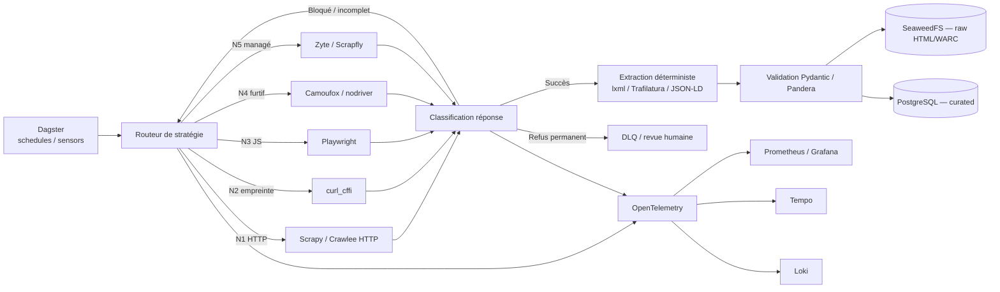

# Stratégie scraping, automatisation web & robustesse anti-bot (2026)

> ⚠️ **Partiellement superseded par le blueprint [`00-hub.md`](00-hub.md) (§6 — décisions verrouillées).**
> Le silo d'acquisition retient le principe **« détecter, classifier, respecter, s'adapter — jamais déjouer »** :
> **pas** de rotation de proxy/identité, d'usurpation d'empreinte ni d'unlockers managés d'évasion. Les sections
> ci-dessous décrivant une **cascade furtive** / des **services d'évasion** sont conservées comme
> **référence / veille**, **pas** comme cible. Cf. **ADR 0021** (monorepo `carto_entreprises`).

> **Doc de référence d'architecture** — pas un benchmark universel. Le détail outil par outil (stars, activité,
> licence, pérennité…) vit dans le **référentiel** `technologies-referentiel.xlsx` (monorepo `carto_entreprises`)
> (catégorie *Scraping & extraction web*). Ce document donne la **stratégie d'escalade**, les **signaux anti-bot**
> et l'**architecture cible**.

## Cadre — ⏸️ POC SANS CONTRAINTES

**Le POC n'a AUCUNE contrainte** (sécurité, légalité, RGPD, robots/allowlist/budget). On collecte et on teste
**librement** pour valider la technologie. **Sécurité, légalité et RGPD dépendent des pays cibles** et font l'objet
d'une **phase dédiée AVANT la mise en production** — voir [§7](#7-sécurité-légalité--rgpd--phase-dédiée-avant-production).

Aucun outil ne garantit un accès permanent : les protections combinent **réputation réseau, empreinte TLS/HTTP,
cohérence du navigateur, comportement, session et réputation du compte**. La bonne réponse est une **cascade
d'escalade**, pas un outil unique.

---

## 1. Principe d'escalade (n'escalader que si nécessaire)

```text
HTTP standard (Scrapy / Crawlee HTTP)
   ↓ si bloqué / contenu incomplet
HTTP avec empreinte transport cohérente (curl_cffi : TLS/JA3, HTTP/2-3)
   ↓
Navigateur réel (Playwright)
   ↓
Navigateur spécialisé / furtif (Camoufox, nodriver, Patchright)
   ↓
Service managé (fallback) — Zyte / Scrapfly / Bright Data / Oxylabs
   ↓
Abandon contrôlé → DLQ / revue humaine
```

Chaque couche agit sur une **strate différente** ; on ne lance pas un navigateur coûteux pour chaque page.

| Couche | Outils (réf. xlsx) | Rôle |
|---|---|---|
| **Transport HTTP / impersonation** | `curl_cffi`, `niquests`, `httpx`, `requests`, `aiohttp`, `tls-client`, `primp`, `rnet` | TLS/JA3/JA4, HTTP/2-3 cohérents — rapide, pas de DOM |
| **Framework de crawl** | **Scrapy**, **Crawlee**, Colly, Apache Nutch, StormCrawler, Heritrix3 | files, retries, throttling, sessions, proxies |
| **Navigateur réel** | **Playwright** (socle), Puppeteer, Selenium | DOM/JS, contextes isolés, interception réseau |
| **Furtif / anti-détection** | Camoufox (Firefox cohérent), nodriver, Patchright, SeleniumBase CDP, botasaurus, zendriver, DrissionPage, playwright-stealth | réduction des traces d'automatisation |
| **Extraction de contenu** | **Trafilatura**, lxml, selectolax, parsel, extruct (JSON-LD/Microdata), jusText, newspaper4k, Resiliparse | contenu principal, métadonnées, dédup |
| **Scraping IA / agents** | Crawl4AI, Firecrawl, Scrapling, Stagehand, browser-use, ReaderLM/Jina, LLM-Scraper | dernier recours, parcours variables |
| **Archivage WARC** | warcio, ArchiveBox, brozzler, pywb, grab-site, Browsertrix | traçabilité / rejouabilité de la collecte |
| **Managé (fallback)** | Zyte, Scrapfly, Bright Data, Oxylabs, ZenRows, ScrapingBee, Browserless, Browserbase, Apify | IP+TLS+navigateur+sessions+challenges externalisés *(SaaS, non self-host)* |

---

## 2. Matrice des signaux anti-bot

| Couche observée | Signaux | Client HTTP | curl_cffi | Playwright standard | Camoufox spécialisé | API managée |
|---|---|---|---|---|---|---|
| IP / ASN | réputation, hébergeur, géo | Faible | Faible | Faible | Faible | **Forte** |
| TLS | JA3/JA4, extensions, ordre | Faible | **Forte** | Forte | Forte | Forte |
| HTTP/2-3 | paramètres, ordre, priorités | Faible | Moy.→Forte | Forte | Forte | Forte |
| En-têtes | ordre, Client Hints, cohérence | Faible | Moyenne | Forte | Forte | Forte |
| JavaScript | `navigator`, permissions, plugins | — | — | Moyenne | **Forte** | Forte |
| Graphique | Canvas, WebGL, GPU | — | — | Réel mais serveur identifiable | Forte si cohérent | Variable→Forte |
| Environnement | fonts, écran, timezone, langue | — | — | À configurer | Généré/cohérent | Géré |
| Comportement | souris, scroll, délais | — | — | À programmer | À programmer | Parfois géré |
| Session | cookies, IP stable, historique | Manuel | Manuel | Bon contrôle | Bon contrôle | Intégré |
| Compte | âge, réputation, historique | — | — | Selon compte | Selon compte | Selon compte |
| Challenge | Turnstile, GeeTest, CAPTCHA | — | — | Interaction possible | Interaction possible | Souvent intégré |
| Rate limiting | débit, burst, régularité | Manuel | Manuel | Manuel | Manuel | Retries/adaptation |

> **Clé** : un bon profil TLS ne compense pas un **ASN datacenter** bloqué ; un navigateur cohérent ne compense pas un **compte neuf** ou une **fréquence anormale**.

---

## 3. CAPTCHA & challenges

| Approche | Type | Couverture | Positionnement |
|---|---|---|---|
| **Clés de test officielles** (Cloudflare…) | simulation contrôlée | tests E2E de NOS protections | prioritaire pour nos propres apps |
| **Human-in-the-loop** | intervention humaine | MFA, validations rares | opérations internes |
| **Solveurs** (ddddocr, hcaptcha-challenger…) | OCR / ML local | CAPTCHA image/texte | au référentiel (catégorie *Anti-bot/CAPTCHA*) |
| **Services solveurs** (CapMonster, CapSolver, 2Captcha) | API | Turnstile, reCAPTCHA, GeeTest, DataDome | SaaS, fallback |

> Le **cadrage légal** de la résolution de challenges relève de la **phase sécurité/légalité avant production** (cf. §7), **pas du POC**.

---

## 4. Outils — classements de synthèse (réf. xlsx pour le détail)

**Open source** — socle : **Playwright** (navigateur), **Crawlee**/**Scrapy** (crawl HTTP), **curl_cffi** (transport),
**Trafilatura**/lxml (extraction) ; furtif : **Camoufox**, nodriver, Patchright ; IA : Crawl4AI, Firecrawl, Scrapling.

**Managé (SaaS, fallback uniquement)** : Zyte / Apify / Bright Data / Scrapfly / Oxylabs / Firecrawl Cloud /
Browserbase / Browserless / ZenRows / ScrapingBee / ScraperAPI. *(Non self-host → hors socle, utilisés en repli.)*

---

## 5. Architecture cible (alignée socle projet)



Cohérent avec la **cascade d'ingestion** du projet (API → HTML déterministe → IA dernier recours, cf.
`structure.md` §7 et ADR 0009 du monorepo `carto_entreprises`) et le socle (Dagster, SeaweedFS,
PostgreSQL) + la couche **observabilité optionnelle** (OpenTelemetry/Prometheus/Grafana/Tempo/Loki — *à suivre*, couche `03`).

---

## 6. KPI de production à mesurer

| Domaine | Indicateurs |
|---|---|
| Acquisition | pages demandées/obtenues, taux 2xx/3xx/4xx/5xx |
| Blocage | taux CAPTCHA, soft-block, page vide, redirection challenge |
| Qualité | champs obligatoires présents, conformité schéma, taux de doublons |
| Performance | p50/p95/p99 par domaine, DNS/TLS/TTFB/rendu/extraction |
| Ressources | CPU, mémoire, bande passante, minutes navigateur |
| Coût | **coût total / nb d'enregistrements valides & uniques** *(la vraie métrique, pas le coût/requête)* |
| Maintenance | sélecteurs cassés, dérive DOM, fréquence des correctifs |

---

## 7. Sécurité, légalité & RGPD — phase dédiée AVANT production

> ⏸️ **Reportée hors POC, par conception.** Sécurité internet, légalité et RGPD **dépendent des pays cibles** ;
> elles sont traitées dans une **phase dédiée pendant la préparation à la production**, **pas au POC**.

Cette phase couvrira alors, selon les juridictions visées :

- **Contrôles de collecte** : robots.txt ([RFC 9309](https://www.rfc-editor.org/info/rfc9309/)), allowlist de domaines,
  budget/fréquence de requêtes, **droit de réutilisation** des sources (licence / CGU / habilitation — ex. RBE, API Entreprise) ;
- **RGPD** : base légale, information, droits & opposition au moissonnage, minimisation, rétention, **purge cross-store**,
  propagation des suppressions (BODACC), registre des traitements, DPIA, mentions / DPO ;
- **Droit des bases de données** (droit *sui generis*) et **droit d'auteur** ;
- **Durcissement sécurité** : secrets, segmentation, egress, journalisation de provenance, localisation des proxies/sous-traitants ;
- **Activation du registre d'autorisation** (ADR 0012 du monorepo `carto_entreprises`) comme **gate** (au POC : simple catalogue, non bloquant).

**Au POC, rien de tout cela n'est actif** : le module `shared/compliance` et `config/sources/registry.yml` existent
comme **placeholders / catalogue**, non bloquants.
